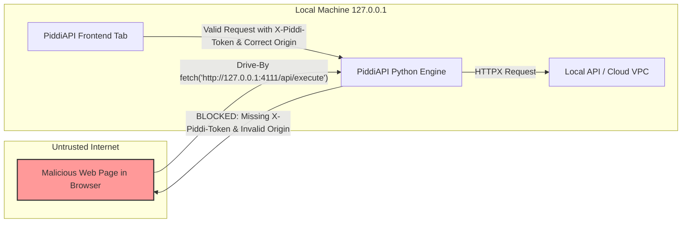
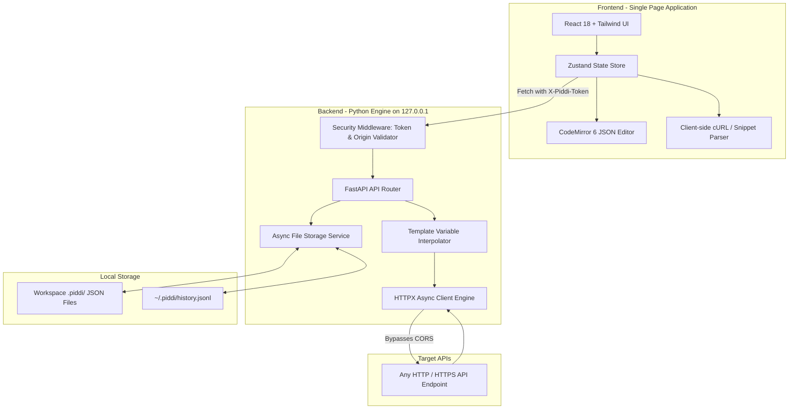
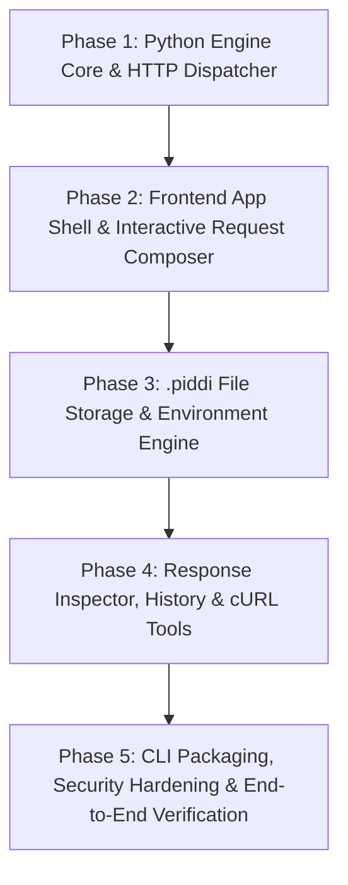

# PiddiAPI — Hostile Architecture & Scope Review

**Reviewer**: Lead Product Architect (Hostile Self-Review Mode)  
**Document Evaluated**: `PLAN.md` (Initial Proposal)  
**Status**: Proposal Rejected in Current Form; Revised to Streamlined MVP Specification  

---

## 1. Executive Verdict

The initial `PLAN.md` attempted to be **Postman, Bruno, Yaak, and HTTPie all at once** on Day 1. It violated its own core tenets: while advertising itself as a "featherweight, zero-bloat, instant-boot" client, it quietly introduced:
1. **Dual storage systems** (SQLite database *plus* Git JSON files).
2. **Dual execution targets** (Electron-style PyWebView desktop windows *plus* local browser serving).
3. **An un-sandboxed scripting engine** (evaluating arbitrary code in the Python backend).
4. **Premature backend IPC hops** (routing client-side concerns like cURL string generation through the Python API).
5. **A critical loopback security vulnerability** (an unauthenticated localhost HTTP server vulnerable to Drive-By SSRF from malicious websites).

**Verdict**: The core thesis of PiddiAPI—a fast, local-first, Git-native, zero-CORS API testing client—is exceptionally strong, but the original architecture suffered from premature feature bloat and unnecessary moving parts. 

By eliminating the SQLite layer, ditching the PyWebView wrapper for MVP, cutting arbitrary scripting in favor of deterministic variable extraction, moving pure UI tasks to the frontend, and hardening the localhost security boundary, we reduce the codebase complexity by **~60%**, eliminate cross-platform compilation headaches, and deliver a truly featherweight product that boots in < 250ms.

---

## 2. Problems Found in PLAN.md

| # | Problem in `PLAN.md` | Why It Is Flawed / Dangerous | Concrete Resolution |
|---|---|---|---|
| **1** | **Hybrid SQLite + JSON Storage** | Two sources of truth. Requires SQLite schema migrations, handles file-to-DB sync locks, complicates Git diffing, and prevents AI agents from inspecting history in plain text. | **Kill SQLite completely.** Use 100% human-readable JSON files for collections/environments and a single circular JSONL file (`~/.piddi/history.jsonl`) for history. |
| **2** | **PyWebView Desktop Window in MVP** | `pywebview` relies on native GUI runtimes (`WebKitGTK` on Linux, `Cocoa WebKit` on macOS, `Edge WebView2` on Windows). Linux dependencies frequently break, and managing async event loops between Uvicorn and OS GUI threads creates subtle deadlocks. | **Browser-First Local Web App for MVP.** The `piddi` CLI starts the local engine and opens `http://127.0.0.1:<port>` in the user's default browser. Zero native compile dependencies. |
| **3** | **Arbitrary Scripting Runtime (Pre/Post Hooks)** | Running user-supplied Python or JS scripts in the backend engine introduces remote code execution (RCE) risks, sandbox escape vectors, and complex execution state tracking. | **Cut scripting from MVP.** For MVP, support static & dynamic variable substitution (`{{var}}`, `{{$uuid}}`, `{{$timestamp}}`). Post-request response token extraction will be purely declarative in Phase 2. |
| **4** | **Unauthenticated Localhost API (Drive-By SSRF Vulnerability)** | A local server on `127.0.0.1:4111` accepting arbitrary HTTP execution requests can be abused by any malicious website visited by the developer in Chrome via simple cross-site `fetch()` calls. | **Mandate Cryptographic Loopback Session Tokens & Origin Verification.** Every frontend-to-backend request must supply a short-lived bearer token generated at CLI startup, with strict `Host` and `Origin` header checking. |
| **5** | **Over-Engineered Backend IPC Routing** | Parsing cURL strings and generating code snippets (Python, fetch, cURL) was routed to the Python backend (`/api/convert/*`), adding network latency to instant UI interactions. | **Shift purely computational UI logic to the Frontend.** cURL parsing, syntax formatting, code snippet generation, and search filtering happen client-side in TypeScript at 0ms latency. |
| **6** | **Unrealistic "50MB JSON Rendering" Goal** | CodeMirror or DOM trees parsing 50MB of raw JSON will allocate > 500MB RAM and freeze the browser thread. | **Define realistic, tiered rendering boundaries.** Full interactive tree/syntax highlight for responses up to 2MB; plain text viewer for 2MB–10MB; direct-to-disk download stream for > 10MB. |

---

## 3. Scope Triage: Ruthless Categorization

```
[MUST HAVE (MVP)]
├── Zero-CORS HTTP/1.1 & HTTP/2 Request Dispatch (GET, POST, PUT, PATCH, DELETE, HEAD, OPTIONS)
├── URL Params, Headers, and Auth (Bearer, Basic, API Key) Editors
├── Body Modes: JSON (with syntax highlight), Form URL-Encoded, Multipart Form-Data, Raw Text
├── Dynamic Variable Interpolation ({{baseUrl}}, {{$uuid}}, {{$timestamp}}, {{$isoDate}})
├── Environment Management (Local, Staging, Prod) with Git-Ignored Secret Overrides
├── Response Viewer: Status Code, Response Time, Size, Headers, Cookies, Formatted JSON
├── Local-First File Storage: Minimal .piddi/collections/*.json and .piddi/environments/*.json
├── Plain-Text Append-Only Request History (~/.piddi/history.jsonl)
├── cURL Import (Paste cURL -> Form) and Export (Copy as cURL / Fetch / Python)
├── Single Command CLI Launcher: `piddi` (with auto-port assignment & browser launch)
└── Hardened Loopback Security (Session Token + Host/Origin Verification)

[SHOULD HAVE (v1.1)]
├── Response Variable Extractor (Declarative JSONPath -> {{variable}} without scripting)
├── Response Body Search & JSON Path Breadcrumb Copy (`data.users[0].id`)
├── Basic Status & Header Assertions (Declarative: Status == 200, Header 'content-type' contains 'json')
├── Collection Folder Hierarchy (Nested sub-folders inside collections)
└── Import from Postman Collection v2.1 & OpenAPI 3.0

[NICE TO HAVE (v1.2+)]
├── Headless Collection CLI Runner (`piddi run ./collection.json` with CLI test report)
├── Request Chaining Runner (Run collection in sequence)
├── PyWebView Optional Desktop Wrapper (`piddi --window`)
└── Response Diff Viewer (Compare two responses side-by-side)

[DO NOT BUILD YET (v2.0+)]
├── WebSocket / SSE Live Streaming Inspector
├── Local Mock Server Engine
├── GraphQL Query Builder & Schema Introspection
└── Sandboxed JavaScript Scripting Runtime

[REMOVE ENTIRELY]
├── ❌ SQLite Database Engine
├── ❌ Cloud Sync, Remote User Accounts, and Centralized Workspaces
├── ❌ Electron Packaging
├── ❌ Arbitrary Python `eval()` / `exec()` Execution Hooks
└── ❌ Telemetry, Analytics, and Crash Reporting Trackers
```

---

## 4. Architectural Decision Reviews

| Component / Decision | 1. Why Needed? | 2. What Problem Does It Solve? | 3. Complexity Introduced | 4. Simpler Solution? | 5. In MVP? |
|---|---|---|---|---|---|
| **Python (`FastAPI` + `HTTPX`)** | Bypasses browser CORS; gives full control over sockets, raw headers, cookies, redirects, and SSL. | Browser `fetch()` cannot inspect raw forbidden headers, cannot bypass CORS, and cannot customize TLS certs. | Requires Python runtime and local HTTP server. | No simpler way to make unrestricted HTTP requests without a native backend. | **YES** |
| **React 18 + Vite + TypeScript** | Rich component tree, fast reactive UI updates, type safety. | Building complex split-pane, tabbed, and editable UI states from scratch in vanilla JS is error-prone. | Build step (`npm run build`). | Svelte is marginally lighter, but React has the largest ecosystem of tested CodeMirror & split-pane components. | **YES** |
| **CodeMirror 6** | High-performance code editing with JSON folding, syntax coloring, line numbers, and search. | Textareas are unusable for structured JSON; Monaco is a 5MB+ memory monster. | Modular API requiring specific extension assemblies. | None that match its balance of lightness (~300KB) and speed. | **YES** |
| **Zustand** | Lightweight client-side state store. | Passing request state, active tabs, and environments across deeply nested React components without Redux boilerplate. | Minimal boilerplate. | React Context (causes unnecessary re-renders on rapid typing). Zustand is superior and tiny (<2KB). | **YES** |
| **SQLite** | Proposed for history and cache. | Structured query indexing. | Schema migrations, locking, binary file corruption, hidden state. | **Single JSONL file.** Plain text, zero migrations, easy for AI to inspect. | **NO (REMOVED)** |
| **JSON Filesystem (`.piddi/`)** | Stores collections & environments. | Git version control, offline-first, transparency, human & AI editable. | Need reliable file reading/writing and atomic saves. | Standard JSON formatted with 2-space indentation. | **YES** |
| **PyWebView** | Native OS desktop window wrapper. | Gives the app a standalone desktop window feel. | Native OS library dependencies (`WebKitGTK`), thread deadlocks with async event loops. | Standard browser tab launched via `webbrowser.open()`. | **NO (REMOVED FROM MVP)** |
| **Loopback Auth Token** | Secures local backend on `127.0.0.1`. | Prevents arbitrary malicious websites in Chrome from calling localhost API endpoints (Drive-By SSRF). | Generating and passing a session token header. | None that are secure. Mandatory. | **YES** |
| **Backend cURL / Snippet Converter** | Proposed converting cURL on backend. | Converting cURL to JSON and JSON to Python/Fetch. | Unnecessary network round-trip for pure string manipulation. | Parse and generate directly in the frontend in TypeScript. | **NO (MOVED TO FRONTEND)** |

---

## 5. Storage Architecture Decision: 100% Plain-Text Filesystem

### The Evaluation

```
Option A: JSON Files Only (+ JSONL for History)  <-- SELECTED FOR MVP
Pros:
- 100% Git-friendly: Diffs are clean, human-readable, and mergeable.
- AI-Agent Friendly: AI coding tools can create, inspect, and update collections with standard file edits.
- Zero Dependencies: No SQLite binaries, no C bindings, no migrations.
- Zero State Divergence: What is on disk is exactly what is in the app.
- Portability: Copying a folder copies the entire workspace.
Cons:
- Large history logs (>100,000 items) are slow to scan (mitigated by capping history at 200 items in MVP).

Option B: SQLite Only
Pros:
- Fast indexed queries.
Cons:
- Binary format: Completely un-diffable in Git.
- Requires schema migrations.
- AI agents cannot directly read/write without SQL tooling.
- Eliminates "Git-native" value proposition.

Option C: Hybrid (JSON Collections + SQLite History)
Pros:
- Fast history queries while keeping collections in Git.
Cons:
- Architectural schizophrenia: Two different persistence lifecycles, error handlers, and backup schemes.
```

### The MVP Storage Contract:
1. **Project Collections**: `.piddi/collections/<collection-id>.json`
2. **Project Environments**: `.piddi/environments/<env-id>.json`
3. **Project Secret Overrides**: `.piddi/environments/<env-id>.secrets.json` (auto-added to `.gitignore`)
4. **Global User History**: `~/.piddi/history.jsonl` (capped at the 200 most recent requests via a lightweight circular log).
5. **App Preferences**: `~/.piddi/preferences.json` (active theme, layout sizes, timeout defaults).

---

## 6. Minimal, Deterministic File Format Specifications

Every field in the `.piddi/` file format has an explicit justification. No garbage metadata.

### 1. Collection Schema (`.piddi/collections/auth.json`)

```json
{
  "id": "col_auth",
  "name": "Authentication API",
  "version": "1.0",
  "headers": [
    { "key": "Accept", "value": "application/json", "enabled": true }
  ],
  "requests": [
    {
      "id": "req_login",
      "name": "User Login",
      "method": "POST",
      "url": "{{baseUrl}}/v1/auth/login",
      "params": [],
      "headers": [
        { "key": "Content-Type", "value": "application/json", "enabled": true }
      ],
      "auth": {
        "type": "none"
      },
      "body": {
        "type": "json",
        "raw": "{\n  \"email\": \"{{userEmail}}\",\n  \"password\": \"{{userPassword}}\"\n}"
      }
    },
    {
      "id": "req_profile",
      "name": "Get Current User Profile",
      "method": "GET",
      "url": "{{baseUrl}}/v1/users/me",
      "params": [
        { "key": "include_roles", "value": "true", "enabled": true }
      ],
      "headers": [],
      "auth": {
        "type": "bearer",
        "token": "{{authToken}}"
      },
      "body": {
        "type": "none",
        "raw": ""
      }
    }
  ]
}
```

### Field Justification:
- `id`: Stable, unique identifier for UI tab binding and references.
- `name`: Human-readable label displayed in the sidebar.
- `version`: Allows smooth schema migrations in future releases.
- `headers`: Collection-level default headers automatically inherited by member requests.
- `requests[].auth`: Explicit per-request auth override (`none`, `bearer`, `basic`, `apikey`, `inherit`).
- `requests[].body.type`: Defines parsing mode (`none`, `json`, `form-data`, `x-www-form-urlencoded`, `raw`).

---

### 2. Environment Schema (`.piddi/environments/local.json`)

```json
{
  "id": "env_local",
  "name": "Local Development",
  "variables": [
    { "key": "baseUrl", "value": "http://localhost:8000", "enabled": true },
    { "key": "userEmail", "value": "dev@example.com", "enabled": true }
  ]
}
```

### 3. Secrets Schema (`.piddi/environments/local.secrets.json` — Git Ignored)

```json
{
  "env_id": "env_local",
  "variables": [
    { "key": "userPassword", "value": "super-secret-local-password" },
    { "key": "authToken", "value": "eyJhbGciOiJIUzI1NiIsInR5cCI6..." }
  ]
}
```

---

## 7. Security Model & Threat Mitigation

PiddiAPI executes arbitrary network traffic from a local machine. It must defend against external threats while granting the local developer full testing flexibility.



### Threat Analysis & Mitigations

| Threat Vector | Attack Scenario | Minimum MVP Mitigation |
|---|---|---|
| **Drive-By Localhost SSRF** | User visits an evil website which scripts background `fetch('http://127.0.0.1:4111/api/execute', {body: steal_aws_creds})`. | **1. Startup Session Token**: Engine creates a 32-byte hex secret printed only to stdout / injected into frontend index HTML. All `/api/*` endpoints require `X-Piddi-Token: <token>`.<br>**2. Origin & Host Check**: Backend immediately aborts requests where `Origin` is not `http://127.0.0.1:<port>` or `Host` is not `127.0.0.1:<port>`. |
| **DNS Rebinding Attacks** | Malicious domain resolves to `127.0.0.1` attempting to bypass same-origin policy. | Strict `Host` header validation inside FastAPI middleware. Abort with HTTP 403 if `Host` != `127.0.0.1:<active_port>`. |
| **Secret Leakage to Git** | Developer accidentally commits production API keys or passwords. | Auto-generate `.piddi/.gitignore` upon initialization containing `*.secrets.json` and `*.local.json`. Mask secret values in UI by default. |
| **Decompression Bombs (Zip/Gzip Bomb)** | Target endpoint returns a recursive 10GB gzip stream disguised as a 1KB JSON payload. | Set a strict max response size limit (e.g. 50MB). HTTPX streaming response reader aborts and throws `PayloadTooLargeError` if decompressed bytes exceed threshold. |
| **Arbitrary File Access via File Upload** | Malicious request template instructs backend to read `/etc/passwd` during multipart file upload. | Backend strictly validates that any multipart upload file path must be explicitly chosen via file picker or within the current workspace boundary. |

---

## 8. Realistic Performance Model & Measurable Benchmarks

Discarding vague marketing buzzwords; establishing concrete, measurable engineering benchmarks:

| Metric | Target | Measurement Method |
|---|---|---|
| **Cold Engine Startup** | **< 300 ms** | Time from invoking `piddi` in terminal to FastAPI listening on `127.0.0.1`. |
| **Request Engine Dispatch Overhead** | **< 3 ms** | Internal elapsed time between FastAPI receiving `/api/execute` and HTTPX placing socket write call. |
| **UI Response Render Latency (Payload < 1MB)** | **< 16 ms (60 FPS)** | Time between frontend receiving HTTP response JSON and CodeMirror rendering DOM. |
| **Large Payload Handling (2MB – 10MB)** | **< 150 ms** | Plain text rendering mode with syntax highlighting disabled for speed. |
| **Huge Payload Handling (> 10MB)** | **Zero UI Freeze** | Response body is written directly to a temporary file; UI displays status, size, headers, and a "Save to Disk" button. |
| **Engine Base Memory Footprint** | **< 35 MB RAM** | Resident Set Size (RSS) of the Python process while idling. |

---

## 9. Final MVP Specification

The **Smallest Genuinely Useful Version of PiddiAPI**:

```
+---------------------------------------------------------------------------------------+
|  PIDDI API   [ Workspace: ./my-api-service ]      [ Env: Local v ]  [ + Env ]  [ ⚙ ]  |
+------------------------------------+--------------------------------------------------+
| COLLECTIONS                        | [GET] http://localhost:8000/api/users/me   [SEND] |
| ---------------------------------- |--------------------------------------------------|
| v Auth API                         | [ Params (1) ] [ Headers (2) ] [ Auth ] [ Body ] |
|   * POST Login                     | Key               | Value          | Active      |
|   * GET Me                         |-------------------+----------------+-------------|
| v Billing                          | limit             | 10             | [x]         |
|   * GET Invoices                   |--------------------------------------------------|
| + New Request                      | RESPONSE: [ 200 OK ]  [ 24 ms ]  [ 1.4 KB ]      |
| ---------------------------------- | [ Body (JSON) ] [ Headers (5) ] [ Raw ] [ cURL ] |
| HISTORY (Last 200)                 | 1  {                                             |
| - 200 GET /api/users/me (24ms)     | 2    "id": "usr_101",                            |
| - 401 POST /api/login (18ms)       | 3    "email": "dev@example.com"                  |
| - 500 GET /api/broken (120ms)      | 4  }                                             |
+------------------------------------+--------------------------------------------------+
| Loopback: 127.0.0.1:4111 | Session Active | Git: Clean (.piddi)                       |
+---------------------------------------------------------------------------------------+
```

### MVP Feature Breakdown
1. **Single-Window Split Layout**:
   - Sidebar: Collections, active requests, environment selector, and chronological history list.
   - Main Panel: Request builder on top, Response viewer on bottom (or side-by-side toggle).
2. **Request Builder**:
   - HTTP Verbs: `GET`, `POST`, `PUT`, `PATCH`, `DELETE`, `HEAD`, `OPTIONS`.
   - Query Params & Headers: Key-value table with checkboxes to toggle parameters on/off.
   - Auth: None, Bearer Token, Basic Auth (`username`/`password`), API Key (`Header` or `Query Param`).
   - Body: `None`, `JSON` (with syntax highlighting and validation), `Form URL-Encoded`, `Multipart Form-Data`, `Raw Text`.
3. **Execution Engine (Python Backend)**:
   - Async HTTP/1.1 & HTTP/2 dispatch via `httpx`.
   - Complete header, cookie, query param, and redirect tracking.
   - SSL certificate verification toggle (allows self-signed certificates on `localhost`).
   - Variable substitution engine (`{{variable}}` and `$uuid`, `$timestamp`, `$isoDate`, `$randomInt`).
4. **Response Inspector**:
   - Status badge with color coding (`2xx` green, `3xx` blue, `4xx` yellow, `5xx` red).
   - Execution duration (ms) and payload size (bytes/KB/MB).
   - Tabbed views: Formatted Body (JSON with syntax folding), Raw Body, Response Headers, Response Cookies.
   - 1-click "Copy as cURL" and "Copy Response Body".
5. **Persistence (.piddi/)**:
   - Save/Rename/Delete requests inside collections.
   - Auto-create `.piddi/collections/` and `.piddi/environments/`.
   - Auto-create `.piddi/.gitignore` with `*.secrets.json`.
   - Global history file in `~/.piddi/history.jsonl`.
6. **CLI Entry Point (`piddi`)**:
   - Starts local backend on next open port (`4111+`).
   - Generates loopback auth token.
   - Automatically opens default browser to the UI.

---

## 10. Final Architecture Diagram



---

## 11. Dependency-Aware Implementation Sequence

Each phase represents a **vertical, testable slice** that produces a functional milestone.



### Phase 1: Python Engine Core & HTTP Dispatcher
- **Objective**: Build the hardened HTTP execution backend and variable interpolation engine.
- **Files Introduced**:
  - `piddi/engine/server.py`: FastAPI server setup with loopback security middleware.
  - `piddi/engine/dispatcher.py`: Async HTTPX executor supporting all verbs, query params, headers, body types, redirects, and SSL flags.
  - `piddi/engine/variables.py`: Variable resolver (`{{var}}`, `$uuid`, `$timestamp`, `$isoDate`, `$randomInt`).
  - `tests/test_dispatcher.py`: Pytest suite verifying execution against a local FastAPI echo test server.
- **Acceptance Criteria**: All HTTP methods, headers, cookies, redirects, timeouts, and variable replacements execute with 100% test pass rate.

### Phase 2: Frontend App Shell & Interactive Request Composer
- **Objective**: Build the lightweight React/Vite/TypeScript UI shell, CodeMirror editor, and request state manager.
- **Files Introduced**:
  - `frontend/src/App.tsx`: Main split layout.
  - `frontend/src/components/RequestPanel.tsx`: Verb selector, URL bar, query param table, header table, auth picker, body editor.
  - `frontend/src/components/CodeEditor.tsx`: CodeMirror 6 JSON/Text editor with syntax highlighting.
  - `frontend/src/store/useRequestStore.ts`: Zustand store for active request draft.
- **Acceptance Criteria**: User can type a URL, edit headers, edit a JSON body with validation, and press `Cmd+Enter` to dispatch a request to the Phase 1 backend.

### Phase 3: `.piddi/` File Storage & Environment Engine
- **Objective**: Implement local file reading/writing for collections, environments, and secret isolation.
- **Files Introduced**:
  - `piddi/storage/file_manager.py`: Async file manager for `.piddi/collections/*.json` and `.piddi/environments/*.json`.
  - `piddi/storage/secrets.py`: Auto-generating `.piddi/.gitignore` and merging `*.secrets.json`.
  - `frontend/src/components/Sidebar.tsx`: Collection tree viewer, request creator, environment switcher modal.
  - `frontend/src/store/useWorkspaceStore.ts`: Zustand workspace and collection state.
- **Acceptance Criteria**: User can create/rename collections, save requests, switch environments, and verify that secret variables are stored strictly in git-ignored secret files.

### Phase 4: Response Inspector, History & cURL Tools
- **Objective**: Complete the response rendering pipeline, history logging, and client-side conversion tools.
- **Files Introduced**:
  - `frontend/src/components/ResponsePanel.tsx`: Status code badge, timing metrics, formatted JSON tree, raw viewer, headers/cookies tables.
  - `frontend/src/utils/curlParser.ts`: Pure TypeScript cURL-to-request parser.
  - `frontend/src/utils/snippetGenerator.ts`: Copy as cURL, Python `httpx`, and JavaScript `fetch`.
  - `piddi/storage/history.py`: Append-only `~/.piddi/history.jsonl` writer and reader (capped at 200 items).
- **Acceptance Criteria**: Responses display with exact timings; pasting cURL populates the request form; previous requests appear in History and can be restored in 1 click.

### Phase 5: CLI Packaging, Security Hardening & End-to-End Verification
- **Objective**: Bind backend and frontend into a single installable package with the `piddi` CLI launcher.
- **Files Introduced**:
  - `piddi/cli.py`: CLI entry point (scans open port, creates session token, serves static frontend, launches browser).
  - `pyproject.toml`: Package configuration, dependencies, and entry-point scripts.
  - `tests/test_e2e.py`: End-to-end integration tests verifying CLI startup, loopback token handshake, and full request-response lifecycle.
- **Acceptance Criteria**: Running `pip install -e .` followed by `piddi` opens the browser, authenticates the session, and operates seamlessly.

---

## 12. Concrete Test Strategy

### 1. HTTP Execution Test Matrix (`pytest tests/test_dispatcher.py`)

| Test Case | Inputs | Expected Output |
|---|---|---|
| **Standard Verbs** | `GET`, `POST`, `PUT`, `PATCH`, `DELETE`, `HEAD`, `OPTIONS` | Status 200, correct method received by echo server. |
| **Query Parameters** | `?page=1&filter=active&tags=a&tags=b` | Properly encoded URL query string. |
| **Custom Headers** | `X-Custom-Header: TestValue`, `Authorization: Bearer 123` | Target server receives exact headers. |
| **JSON Body** | `{"user": "alex", "age": 30}` | Target receives `Content-Type: application/json` and exact JSON payload. |
| **Form URL-Encoded** | `key1=val1&key2=val2` | `Content-Type: application/x-www-form-urlencoded` properly formatted. |
| **Multipart Upload** | File attachment + text field | Multi-part boundary generated and received intact. |
| **Variable Substitution** | `{{baseUrl}}/users/{{$uuid}}` | Replaced with active environment `baseUrl` and valid v4 UUID. |
| **Redirect Following** | 301/302 redirect with toggle enabled/disabled | Follows redirect or returns 301/302 status code based on config. |
| **Self-Signed TLS** | HTTPS server with invalid cert + `verify_ssl: false` | Successfully returns response without SSL error. |
| **Timeout Handling** | Server takes 5s, timeout set to 1s | Graceful `TimeoutError` response with 0ms transfer time. |
| **Oversized Response** | Target returns 60MB payload | Engine truncates or aborts safely without crashing memory. |

### 2. Security Test Matrix (`pytest tests/test_security.py`)

| Attack Vector | Test Input | Expected Defense |
|---|---|---|
| **Missing Session Token** | `POST /api/execute` with no `X-Piddi-Token` | `HTTP 401 Unauthorized`. |
| **Invalid Origin** | `POST /api/execute` with `Origin: http://evil-site.com` | `HTTP 403 Forbidden`. |
| **DNS Rebinding Host** | `GET /api/collections` with `Host: evil-rebound-domain.com` | `HTTP 403 Forbidden`. |
| **Path Traversal in Collection** | `GET /api/collections/../../etc/passwd` | `HTTP 400 Bad Request` / Normalized path guard. |

---

## 13. Summary of Changes Made from Initial Proposal

1. **Eliminated SQLite**: Replaced with 100% human-readable JSON files and a simple circular JSONL history file.
2. **Eliminated PyWebView**: Adopted a browser-first distribution model for MVP to avoid native OS GUI build failures.
3. **Eliminated Scripting**: Removed un-sandboxed Python/JS execution hooks from MVP to maintain safety and simplicity.
4. **Moved UI Logic to Frontend**: cURL parsing and code snippet generation run entirely client-side.
5. **Hardened Localhost Security**: Added mandatory startup session token authentication and strict Host/Origin checking to prevent Drive-By SSRF.
6. **Right-Sized Performance Targets**: Replaced arbitrary "50MB JSON" rendering with tiered rendering limits (<2MB interactive, 2–10MB plain, >10MB direct download).
