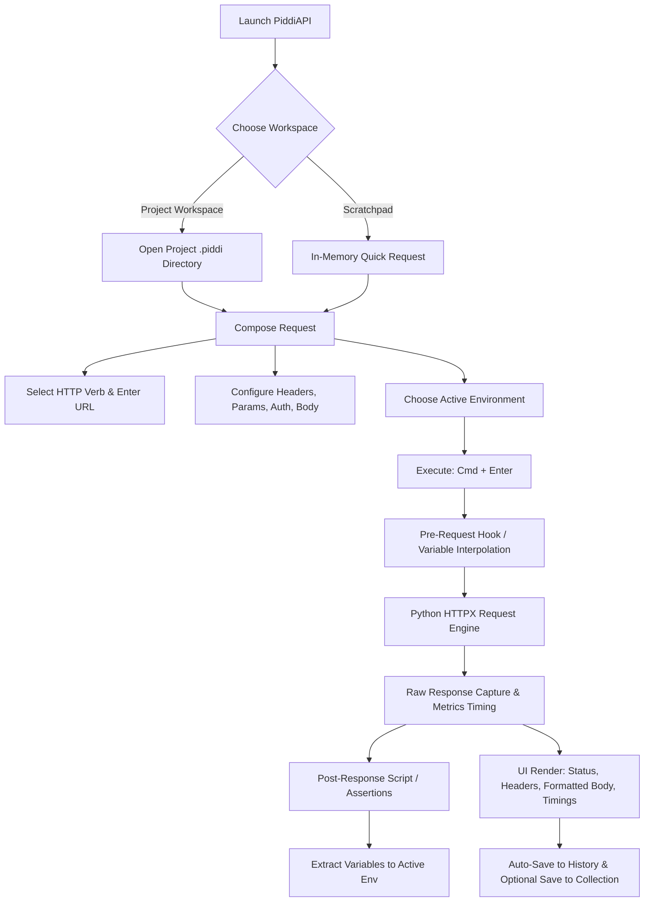
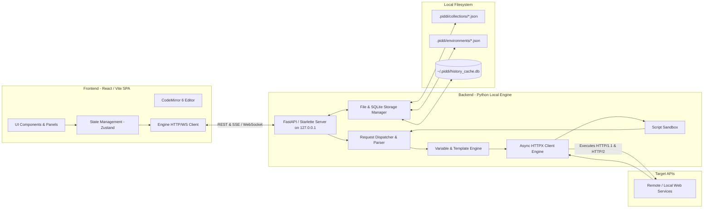
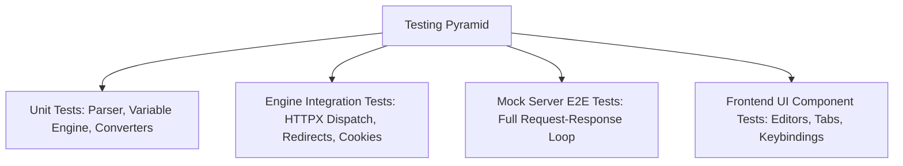

# PiddiAPI — Comprehensive Architecture & Product Plan

## 1. Product Vision

**PiddiAPI** (from *Piddi* — tiny, lightweight, featherweight) is a fast, local-first, zero-bloat API development and testing client built for developers who are tired of heavyweight, cloud-mandated, telemetry-heavy tools.

Where modern commercial tools have drifted toward mandatory cloud sync, account lock-in, sluggish startup times, and 500MB+ memory footprints, PiddiAPI delivers:
- **Instant startup** (< 500ms) and minimal RAM footprint.
- **100% Local-First & Offline-Native**: Collections, environments, history, and secrets live in human-readable, Git-friendly files on your local filesystem.
- **Zero Cloud Mandates**: No forced logins, no remote workspace telemetry, no subscription paywalls for basic developer features.
- **Uncompromised HTTP Power**: Full HTTP/1.1 & HTTP/2 protocol support, dynamic variable substitution, chained requests, multipart/binary bodies, streaming response inspection, and cURL interoperability.
- **AI-Agent Ready**: Transparent, deterministic plain-text collection formats and simple CLI interfaces so both humans and AI coding assistants can generate, inspect, and execute requests seamlessly.

---

## 2. Goals and Non-Goals

### Goals
- **Blazing Performance**: Sub-second app boot, zero UI lag on large payloads (up to 50MB JSON with virtualized rendering), and sub-millisecond local request dispatch overhead.
- **Git-Native Storage**: Request collections stored as clean, formatted JSON/YAML files that can be committed directly alongside code in a repository (`.piddi/`).
- **No CORS Constraints**: Request execution happens via a local backend engine, granting full access to raw sockets, custom headers, cookies, redirects, and SSL configuration without browser sandbox limitations.
- **Fluid, Keyboard-Centric UX**: Ergonomic hotkeys for sending requests (`Cmd+Enter`), switching tabs, searching history, and toggling environments.
- **Environment & Vault System**: Multi-environment variables (`dev`, `staging`, `prod`) with layered inheritance, dynamic generators (`{{$uuid}}`, `{{$isoTimestamp}}`, `{{$randomInt}}`), and encrypted/gitignored local secret vaults (`.env` / `.piddi.secrets`).
- **Pre-Request & Post-Response Chaining**: Lightweight pre-flight hooks and assertion/extraction scripts (e.g. automatically saving a JWT from `/auth/login` to `{{authToken}}`).
- **Interoperability**: Bidirectional 1-click import/export for cURL, Postman Collection v2.1, OpenAPI/Swagger 3.0, and HTTP snippets (Python `httpx`/`requests`, JavaScript `fetch`, Go, cURL).
- **Dual Form Factor**: Run as a standalone desktop window (via lightweight native webview) or as a local browser tab via CLI (`piddi`).

### Non-Goals
- **No Cloud Sync or Remote Multi-Tenancy**: We will not build a centralized hosted database or SaaS team synchronization service. Collaboration is handled naturally through Git.
- **No Heavyweight Multi-Protocol Sprawl on Day 1**: No gRPC, SOAP, or MQTT in the initial MVP. REST/HTTP (1.1 & 2) is the primary core. (WebSocket/SSE will be supported in Phase 3).
- **No Complex Enterprise RBAC / Billing**: No user permissions, seat licensing, or enterprise SSO.
- **No Electron**: Avoid shipping 150MB+ Chromium binaries; use native system webview or local browser serving.

---

## 3. Target Users & Personas

| Persona | Core Need | Key PiddiAPI Value |
|---|---|---|
| **Solo Full-Stack / Backend Dev** | Testing APIs during local development; inspecting response headers, cookies, and timings. | Starts instantly; zero setup; bypasses CORS; saves requests directly in project folder. |
| **Frontend Engineer** | Validating backend endpoints, debugging auth tokens, viewing payload schemas. | Clean JSON folding/formatting, instant search, copy-as-fetch snippet generation. |
| **AI-Assisted Developer** | Interacting with APIs with help from AI agents (like Claude/Antigravity/Cursor). | Plain-text collection format (`.piddi/*.json`) makes it trivial for AI to create/edit test collections. |
| **QA / Automation Engineer** | Running regression suites locally and in CI/CD pipelines. | Headless CLI test runner (`piddi run ./collection.json`) with assertion reports. |

---

## 4. Core User Workflows



### Workflow 1: Rapid Ad-Hoc Request (The "Scratchpad" Flow)
1. User opens PiddiAPI (or runs `piddi` in terminal).
2. UI opens immediately with a blank tab.
3. User pastes a URL (or cURL command, which auto-populates verb, headers, and body).
4. Presses `Cmd+Enter`.
5. Response renders in < 50ms with status code, response time breakdown, headers, and formatted JSON.

### Workflow 2: Git-Backed Collection Development
1. Developer navigates to their API project repository and launches `piddi .`
2. PiddiAPI discovers or initializes `.piddi/` in the current folder.
3. Developer creates a collection: "Auth API", adds requests ("1. Login", "2. Get Profile", "3. Refresh Token").
4. In "Login", post-response script runs: `piddi.env.set("token", res.json().access_token)`.
5. Running "Get Profile" automatically uses `Bearer {{token}}`.
6. Files are saved as `.piddi/collections/auth.json` and committed to Git. Teammates pull the repo and have identical runnable requests.

### Workflow 3: Environment Switching & Secrets
1. Developer creates environments: `Local` (`baseUrl = http://localhost:8000`), `Staging` (`baseUrl = https://staging.api.dev`), `Prod` (`baseUrl = https://api.prod.com`).
2. Secrets (`apiKey`, `clientSecret`) are stored in `.piddi/environments/local.secrets.json` (auto-added to `.gitignore`).
3. Switching the dropdown instantly swaps all `{{baseUrl}}` and `{{apiKey}}` tokens.

---

## 5. Feature Inventory

### Essential Features (MVP - Phase 1 & 2)
1. **HTTP Request Composer**:
   - Verbs: `GET`, `POST`, `PUT`, `PATCH`, `DELETE`, `HEAD`, `OPTIONS`.
   - URL path parameter and query parameter key-value editor with enable/disable toggles.
   - Headers editor with auto-complete for standard HTTP headers.
   - Auth handlers: None, Bearer Token, Basic Auth, API Key (Header/Query).
   - Body types: None, JSON (with linting/formatting), Form URL-Encoded, Multipart Form-Data (with file picker), Raw Text, Binary File.
2. **Execution Engine (Python HTTPX)**:
   - Full async HTTP/1.1 & HTTP/2 dispatch.
   - Configurable timeout, redirect following, SSL verification toggling, proxy support.
   - Detailed timing breakdown (DNS lookup, TCP handshake, TLS negotiation, TTFB, Content Download).
   - Cookie jar handling (session cookie persistence across requests).
3. **Response Inspector**:
   - Status badge with HTTP status description (e.g. `200 OK`, `404 Not Found`) and color coding.
   - Formatted viewer with syntax highlighting (JSON, XML, HTML, Plain Text, Image/SVG preview, Raw binary download).
   - JSON viewer features: search, fold/unfold, path copying (`data.users[0].id`), full copy.
   - Headers viewer, Cookie viewer, and Network timing waterfall.
4. **Environments & Dynamic Variables**:
   - Global, environment-level, and collection-level variables.
   - Double-curly syntax: `{{variable_name}}`.
   - Built-in dynamic functions: `{{$uuid}}`, `{{$timestamp}}`, `{{$isoTimestamp}}`, `{{$randomInt}}`, `{{$randomEmail}}`.
   - Secret variables (masked in UI, kept out of git-tracked files).
5. **Collections & Folders**:
   - Nested folder hierarchy.
   - Reorder requests via drag-and-drop or hotkeys.
   - Collection-level inheritance for Headers and Authentication.
6. **History & Scratchpad**:
   - Automatic recording of executed requests.
   - Filterable, searchable request log.
   - One-click restore from history to active tab.
7. **cURL & Code Generation**:
   - Paste cURL to import request instantly.
   - Copy as cURL, Python (`httpx`/`requests`), JavaScript (`fetch`/`axios`), Go, Rust.

### Optional / Phase 3 & 4 Features
- Pre-request and post-response assertion scripting (lightweight Python or quick JS sandbox).
- Collection runner (sequential execution of all requests in a folder with pass/fail assertion summary).
- Headless CLI runner (`piddi run <collection_file>`).
- WebSocket / Server-Sent Events (SSE) live streaming inspector.
- OpenAPI / Swagger 3.0 import and export.
- Local Mock Server (simulate API responses based on saved examples).

### Explicitly Excluded Features (Non-Goals)
- ❌ Cloud accounts, cloud login, or hosted cloud storage.
- ❌ Proprietary binary collection formats.
- ❌ Heavyweight Electron packaging.
- ❌ Cloud-based team collaboration portals or billing tiers.
- ❌ Cluttered enterprise API governance dashboards.

---

## 6. UX & Design Architecture

### Layout Structure

```
+---------------------------------------------------------------------------------------+
|  [PiddiAPI]  [Workspace: ~/my-api-proj]       [Env: Staging v]  [Cookies]  [Settings] |
+------------------------------------+--------------------------------------------------+
| SIDEBAR (Resizable, 260px)        | REQUEST / RESPONSE SPLIT VIEW (Adjustable 50/50) |
| [Collections] [History]           |                                                  |
| ---------------------------------  | Tab 1: GET /users/123 [x]   Tab 2: POST /login + |
| v Auth API                         |--------------------------------------------------|
|   - POST /login                    | [GET v] [ https://api.dev/v1/{{userId}} ] [Send] |
|   - POST /refresh                  |--------------------------------------------------|
| v Users                            | [Params (2)] [Headers (3)] [Auth] [Body] [Script]|
|   - GET /users/{{userId}}          | Key              | Value         | Description   |
|   - PUT /users/{{userId}}          |------------------+---------------+---------------|
|   + New Request                    | limit            | 20            | Page size     |
| ---------------------------------  | offset           | 0             | Cursor        |
| HISTORY                            |--------------------------------------------------|
| - 200 GET /users/123 (12ms)        | RESPONSE: [200 OK]  [142ms]  [2.4 KB]            |
| - 401 POST /login (84ms)           | [Body (JSON)] [Headers (7)] [Cookies] [Timeline] |
|                                    | 1  {                                             |
|                                    | 2    "id": "usr_991",                            |
|                                    | 3    "name": "Alex Vance"                        |
|                                    | 4  }                                             |
+------------------------------------+--------------------------------------------------+
| Status: Engine connected (127.0.0.1:4111) | Memory: 38MB | Latency: 1.2ms             |
+---------------------------------------------------------------------------------------+
```

### Aesthetic & Interaction Principles
1. **Zero Clutter, High Information Density**: Clean borders, refined typography (JetBrains Mono / Inter), high-contrast legible syntax highlighting.
2. **Keyboard First**:
   - `Cmd+Enter` / `Ctrl+Enter`: Send request.
   - `Cmd+T` / `Ctrl+T`: New request tab.
   - `Cmd+W` / `Ctrl+W`: Close tab.
   - `Cmd+K` / `Ctrl+K`: Global command palette (jump to request, switch environment, search history).
   - `Cmd+S` / `Ctrl+S`: Save active request to collection.
   - `Cmd+B` / `Ctrl+B`: Toggle sidebar.
3. **Response Highlighting & Virtualization**: Fast rendering of multi-megabyte JSON payloads using virtualized DOM lines without freezing the UI.
4. **Adaptive Themes**: Refined Dark Theme (slate/zinc tones, not muddy purple) and crisp Light Theme.

---

## 7. Recommended Technology Stack

### Stack Comparison & Trade-off Analysis

| Layer | Candidate A | Candidate B | Selected Option | Rationale |
|---|---|---|---|---|
| **Backend Engine** | Python (`FastAPI` + `HTTPX`) | Node.js (`Fastify` + `undici`) | **Python (`FastAPI` + `HTTPX`)** | Native fit for Python workspace; HTTPX provides outstanding async HTTP/1.1 & HTTP/2 client capabilities, cookie jars, proxy, and SSL control. Zero CORS issues. |
| **Frontend Framework** | React 18 + Vite + TypeScript | Svelte / SolidJS | **React 18 + Vite + TypeScript** | Rich ecosystem for code editors (CodeMirror 6), JSON trees, split panes, and component state management. AI assistants generate highly reliable TSX/React code. |
| **Editor / Syntax** | Monaco Editor | CodeMirror 6 | **CodeMirror 6** | Monaco is ~5MB+ and heavy; CodeMirror 6 is modular, lightweight (~300KB), fast, and supports JSON linting, search, and bracket matching effortlessly. |
| **Styling** | Tailwind CSS v3 / Vanilla CSS | Material UI / AntD | **Tailwind CSS + Vanilla CSS Tokens** | Zero runtime CSS overhead, maximum customizability, responsive fluid layout, easy dark/light themes. |
| **Local Storage** | Single monolithic JSON | SQLite + Git-friendly JSON files | **Hybrid: SQLite + Git JSON** | SQLite for ephemeral history, cache, tabs, and fast queries; clean `.piddi/*.json` files for collections/environments that users commit to Git. |
| **Desktop Wrapper** | Electron | PyWebView / Native Browser | **Dual Mode: Web Browser / PyWebView** | Launching `piddi` opens in default browser with zero install, or uses `pywebview` for a lightweight native window (~20MB RAM vs 300MB+ for Electron). |

---

## 8. System Architecture



### Frontend / Backend Responsibilities

1. **Frontend (Browser / Webview)**:
   - Renders the interactive UI, tab management, keybindings, and form controls.
   - Manages active editing state, drafts, and UI layout preferences.
   - CodeMirror 6 integration for request body editing and response formatting.
   - Sends structured execution requests to `http://127.0.0.1:<port>/api/execute`.
2. **Backend Engine (Python Service)**:
   - **Bypasses Browser CORS**: Connects directly to external servers over raw sockets via `httpx.AsyncClient`.
   - **Variable Interpolation**: Resolves `{{variables}}`, environments, and dynamic functions (`{{$uuid}}`) before dispatching.
   - **Timing & Telemetry**: Accurately measures TCP, TLS, TTFB, and transfer timings using custom HTTPX event hooks.
   - **Local File & DB Sync**: Watches and syncs the `.piddi/` folder for changes and maintains the SQLite history store.
   - **Security Guard**: Restricts local engine API access via a local loopback token to prevent malicious websites from triggering local requests.

---

## 9. Data Model & File Formats

### 1. Collection File Schema (`.piddi/collections/<collection_name>.json`)

```json
{
  "$schema": "https://piddiapi.dev/schema/collection-v1.json",
  "id": "col_auth_01",
  "name": "Auth API",
  "description": "Authentication and user session management endpoints",
  "auth": {
    "type": "bearer",
    "token": "{{authToken}}"
  },
  "headers": [
    { "key": "X-Client-Version", "value": "1.0.0", "enabled": true }
  ],
  "items": [
    {
      "id": "req_login_01",
      "name": "Login with Email",
      "method": "POST",
      "url": "{{baseUrl}}/api/v1/auth/login",
      "params": [],
      "headers": [
        { "key": "Content-Type", "value": "application/json", "enabled": true }
      ],
      "auth": { "type": "none" },
      "body": {
        "type": "json",
        "raw": "{\n  \"email\": \"{{userEmail}}\",\n  \"password\": \"{{userPassword}}\"\n}"
      },
      "scripts": {
        "preRequest": "",
        "postResponse": "piddi.env.set('authToken', res.json.access_token);"
      }
    }
  ]
}
```

### 2. Environment Schema (`.piddi/environments/staging.json`)

```json
{
  "id": "env_staging",
  "name": "Staging",
  "variables": [
    { "key": "baseUrl", "value": "https://staging.api.example.com", "enabled": true, "secret": false },
    { "key": "userEmail", "value": "qa.test@example.com", "enabled": true, "secret": false },
    { "key": "apiKey", "value": "stg_sec_991823", "enabled": true, "secret": true }
  ]
}
```

### 3. SQLite Local Store (`~/.piddi/piddi.db`)
Used strictly for local ephemeral data:
- `history`: `(id, timestamp, method, url, request_data, status_code, response_time_ms, response_size, response_headers, response_body_preview)`
- `tabs_state`: `(tab_id, position, is_dirty, active_request_payload)`
- `app_settings`: `(key, value)` (e.g. theme, font size, default timeout, SSL verify defaults).

---

## 10. Engine API Contracts

The local backend engine exposes a lean REST/WebSocket API consumed by the frontend:

### Core Endpoints

| Endpoint | Method | Purpose | Payload / Response |
|---|---|---|---|
| `/api/health` | `GET` | Health check & engine metadata | `{ "status": "ok", "version": "0.1.0", "pid": 1234 }` |
| `/api/execute` | `POST` | Execute an HTTP request | **Body**: Full request spec (method, url, headers, body, auth, env_id).<br>**Response**: `{ status, status_text, headers, body, cookies, timings, size, error }` |
| `/api/workspaces/current` | `GET` | Get active workspace info | Returns active `.piddi` path, collections, environments list. |
| `/api/collections` | `GET`, `POST` | List or create collections | JSON list of collections in active directory. |
| `/api/collections/{id}` | `GET`, `PUT`, `DELETE` | Read/update/delete collection | Collection JSON payload. |
| `/api/environments` | `GET`, `POST` | List or create environments | Environment configs list. |
| `/api/environments/{id}` | `PUT`, `DELETE` | Update/delete environment | Environment JSON payload. |
| `/api/history` | `GET`, `DELETE` | Paginated request history | History list with search/filter queries. |
| `/api/convert/curl` | `POST` | Parse cURL into request object | `{ "curl": "curl -X POST..." }` -> Request Model |
| `/api/convert/snippet` | `POST` | Generate code snippet from request | Target: `python`, `fetch`, `go`, `curl` -> `{ "code": "..." }` |

---

## 11. Security Model

1. **Loopback Only**: Backend engine binds exclusively to `127.0.0.1` (localhost) with a random session token generated at startup, preventing unauthorized external access or malicious browser cross-origin triggers.
2. **Local Secrets Isolation**:
   - Variables marked as `secret: true` can be stored in `.piddi/environments/*.secrets.json`.
   - The `.piddi/.gitignore` template automatically ignores `*.secrets.json` and `*.local.json`.
3. **No External Telemetry**: Zero analytics pings, zero remote error reports, zero cloud calls. Your data never leaves your computer.
4. **SSL / TLS Flexibility**: User can toggle SSL certificate verification per request or globally (crucial for local development with self-signed HTTPS certificates).
5. **Script Execution Safety**: Pre/post scripts execute within a restricted environment with access only to request/response manipulation helpers (`piddi.env`, `piddi.variables`, `res.json()`), without arbitrary OS shell execution privileges.

---

## 12. Testing Strategy



1. **Backend Unit & Integration Tests (`pytest`)**:
   - **Variable Substitution**: Interpolation of single, nested, and missing variables; dynamic `$uuid`, `$timestamp`.
   - **Request Engine**: Testing all HTTP verbs, query params, form uploads, multipart uploads, gzip/brotli compression, cookie persistence.
   - **cURL Parser**: Testing standard cURL flags (`-X`, `-H`, `-d`, `--data-raw`, `-F`, `-u`, `-k`, `-L`).
   - **File Sync Engine**: Reading/writing `.piddi/` JSON specs without loss of formatting.
2. **End-to-End Test Harness**:
   - A built-in local FastAPI test echo server (`/test/echo`, `/test/slow`, `/test/stream`, `/test/status/{code}`, `/test/auth`) used to verify exact timing measurements, headers round-tripping, and binary streaming.
3. **Frontend Component & Integration Tests (`vitest` / Playwright)**:
   - CodeMirror editor typing, tab navigation, keyboard shortcuts, history filtering.

---

## 13. Development Phases & Milestones

```
Phase 1: Core Engine & Data Models (Days 1-2)
├── Python Backend Structure (FastAPI + HTTPX)
├── Request Execution Engine with Timings & Cookies
├── Variable Substitution Engine & Dynamic Generators
├── cURL Parser & Code Generator
└── Pytest Test Harness & Echo Server

Phase 2: Modern Frontend & Interactive UI (Days 3-4)
├── React + Vite + Tailwind Base Setup
├── Main Layout: Sidebar, Split Panes, Header Toolbar
├── Request Composer (Verb, URL, Key-Value Params/Headers, Body Editors)
├── CodeMirror 6 JSON/Text Body Editor
├── Response Inspector (Status badge, Formatted JSON, Headers, Timings)
└── Tab Management & Keyboard Shortcuts (Cmd+Enter, Cmd+T, Cmd+W)

Phase 3: Collections, Environments & File Storage (Days 5-6)
├── Local-First .piddi File Storage Manager (JSON collections & environments)
├── Environment Switcher & Variable Highlighting in URL/Headers
├── History Log & Search with SQLite Persistence
├── Secrets Isolation (.secrets.json + auto .gitignore)
└── Drag-and-drop Collection & Request Reordering

Phase 4: Advanced Utilities & Polish (Days 7-8)
├── Pre-Request & Post-Response Scripting (Token extraction)
├── Multipart File Uploads & Binary Response Previews (Images/PDFs)
├── Code Snippet Generator (Python, JS Fetch, cURL, Go)
├── CLI Launcher (`piddi` command with auto-port & browser open)
└── Optional PyWebView Native Desktop Window Mode

Phase 5: Quality Assurance, Hardening & Release (Days 9-10)
├── Performance benchmarking on 50MB JSON payloads
├── Cross-platform verification (macOS, Linux, Windows)
├── Comprehensive documentation & User Quickstart Guide
└── Clean packaging (pip installable package / standalone binary)
```

---

## 14. Dependencies

### Backend (Python 3.10+)
- `fastapi` & `uvicorn`: Ultra-fast local REST server.
- `httpx[http2]`: Asynchronous HTTP/1.1 and HTTP/2 client engine.
- `pydantic`: Strong typing and schema validation for requests/collections.
- `aiofiles`: Asynchronous local file I/O.
- `aiosqlite`: Lightweight async SQLite for history & cache.
- `rich`: Beautiful terminal output for CLI.
- *(Optional)* `pywebview`: Native OS webview for single-window desktop app without Electron.

### Frontend
- `react`, `react-dom` (v18+): UI component library.
- `vite`: Instant dev server & blazing fast builds.
- `typescript`: Type-safe contracts matching Python Pydantic models.
- `tailwindcss`: Lightweight utility styling.
- `codemirror` & `@codemirror/lang-json`: Lightweight, high-performance editor.
- `lucide-react`: Modern, clean featherweight icons.
- `zustand`: Minimal, unopinionated client state management.

---

## 15. Risks and Mitigations

| Risk | Impact | Mitigation Strategy |
|---|---|---|
| **Large Response Payloads Freezing UI** (e.g. 20MB JSON) | High | Use virtualized rendering in CodeMirror / DOM; truncate initial syntax highlight parsing for payloads > 5MB with a "Render Full Raw" button. |
| **Local Port Conflicts** | Low | Engine scans for next available port starting at `4111` (e.g. `4111`, `4112`, ...) and reports active URL to the CLI/UI. |
| **Self-Signed SSL Certificates on Local APIs** | Medium | Provide an explicit "Disable SSL Verification" toggle in the request settings and environment configuration. |
| **File Sync Conflicts with External Editors** | Medium | Debounce file writes, use atomic file saving (`write to temp + rename`), and validate schema on load. |
| **Security Risk from Arbitrary Web Pages Calling Engine** | High | Enforce a local secret session token header (`X-Piddi-Session-Token`) verified on all `/api/*` endpoints. |

---

## 16. Definition of Done (DoD)

1. **Performance**: Cold startup time under 500ms; request dispatch overhead under 2ms; UI stays 60fps when switching tabs.
2. **Reliability**: All core HTTP methods, streaming responses, and file uploads pass 100% of integration test suites against local echo servers.
3. **Usability**: Can import a cURL command, modify headers/params, select an environment, hit `Cmd+Enter`, view formatted JSON, and extract a token in under 10 seconds.
4. **Data Integrity**: Collections saved to `.piddi/` are standard, clean JSON files with zero proprietary garbage, immediately diffable in Git.
5. **No Electron**: App runs with < 50MB RAM footprint in browser/webview mode.

---

## 17. Open Questions for User Approval

1. **Desktop Window vs Browser Mode**:
   - Would you prefer PiddiAPI to launch primarily as a **Local Browser Tab** (like Jupyter / Live Server via `piddi`), a **Native Desktop Window** (using `pywebview`), or support **both** via flags (e.g. `piddi` opens browser, `piddi --window` opens native window)? *(Recommended: Support both, defaulting to native window if available or browser)*.
2. **Collection File Format**:
   - Do you prefer individual `.json` files per collection in `.piddi/collections/` (Postman/Bruno style), or `.http` / `.rest` plain text files (RFC 7230 style like VS Code REST Client), or standard JSON? *(Recommended: Human-readable JSON with `.piddi/` structure for richest feature parity)*.
3. **Scripting Language for Pre/Post Hooks**:
   - Should pre/post-request scripting use a lightweight **JavaScript** syntax (familiar to Postman/Bruno users) or native **Python** expressions? *(Recommended: Lightweight JavaScript syntax for familiar `piddi.env.set(...)` and standard JSON manipulation, with Python engine execution).*
