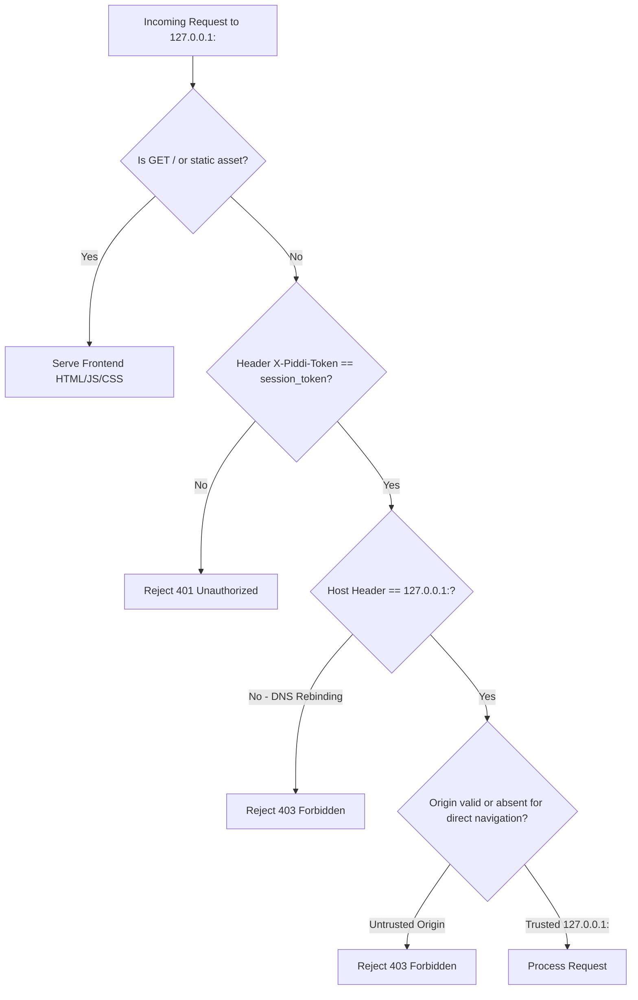
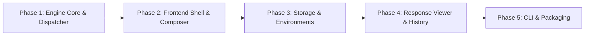

# PiddiAPI — Technical Specification & Implementation Contract

**Document Version**: 1.0.0 (Final)  
**Status**: APPROVED IMPLEMENTATION CONTRACT  
**Target Runtime**: Python 3.10+ & Modern Evergreen Browsers (Chrome/Edge/Firefox/Safari)  

---

## 1. Final Technology Stack

Every dependency in PiddiAPI is explicitly justified to ensure zero bloat, maximum maintainability, and rapid execution.

### Backend (Python)

| Package | Version | Purpose & Justification |
|---|---|---|
| **Python** | `>=3.10` | Base runtime. Modern typing (`\|`, `match`), async I/O. |
| **fastapi** | `^0.111.0` | High-performance asynchronous API framework for localhost engine. Provides automatic OpenAPI docs and strict Pydantic validation. |
| **uvicorn[standard]** | `^0.30.0` | Ultra-fast ASGI server for running FastAPI on `127.0.0.1`. |
| **httpx[http2]** | `^0.27.0` | Async HTTP/1.1 and HTTP/2 client engine. Provides connection pooling, raw header control, cookie jars, proxy support, custom SSL contexts, and streaming. |
| **pydantic** | `^2.7.0` | Data modeling, schema validation, and serialization. |
| **aiofiles** | `^24.1.0` | Asynchronous file system reads and writes for `.piddi/` directory files and JSONL history. |
| **pytest** | `^8.2.0` | Test runner for backend unit and integration suites. |
| **pytest-asyncio** | `^0.23.0` | Async test fixtures and test execution for FastAPI and HTTPX tests. |
| **ruff** | `^0.4.0` | Blazing-fast linter and formatter for Python. |

### Frontend (TypeScript / React)

| Package | Version | Purpose & Justification |
|---|---|---|
| **React & React-DOM** | `^18.3.0` | UI component library. Mature ecosystem for editors, tabs, and split panes. |
| **Vite** | `^5.3.0` | Blazing-fast frontend dev server and production bundler. Single-command build. |
| **TypeScript** | `^5.4.0` | Strict type safety aligned 1-to-1 with backend Pydantic models. |
| **Tailwind CSS** | `^3.4.0` | Utility-first styling with zero runtime CSS overhead and dark mode support. |
| **zustand** | `^4.5.0` | Lightweight (~1.5KB) client state management. Zero boilerplate; prevents unnecessary re-renders. |
| **codemirror** | `^6.0.0` | Modern, modular code editor (~300KB). Powers the JSON/Text body editor and response viewer with syntax highlighting and folding. |
| **@codemirror/lang-json**| `^6.0.0` | JSON language support, linting, and bracket matching for CodeMirror. |
| **@codemirror/theme-one-dark** | `^6.1.0` | Standard dark theme for CodeMirror editor. |
| **lucide-react** | `^0.390.0` | Crisp, featherweight SVG icon library. |
| **vitest** | `^1.6.0` | Fast unit test runner for client-side parsers and snippet generators. |

---

## 2. Repository Structure

```
piddiapi/
├── piddi/                       # Python Backend Package
│   ├── __init__.py              # Package version (__version__ = "0.1.0")
│   ├── cli.py                   # CLI entry point (`piddi` command)
│   ├── config.py                # App configuration, port selection, runtime paths
│   ├── main.py                  # FastAPI application instance & lifespan
│   ├── engine/                  # Request Execution Core
│   │   ├── __init__.py
│   │   ├── dispatcher.py        # HTTPX execution engine & event timing
│   │   └── variables.py         # Dynamic variable interpolation & template resolver
│   ├── storage/                 # Filesystem Persistence Layer
│   │   ├── __init__.py
│   │   ├── file_manager.py      # Async reader/writer for .piddi/ JSON files
│   │   └── history.py           # Circular JSONL history manager (~/.piddi/history.jsonl)
│   ├── models/                  # Shared Pydantic Schemas
│   │   ├── __init__.py
│   │   ├── request.py           # Execution Request & Header/Param models
│   │   ├── response.py          # Execution Response & Timing models
│   │   ├── collection.py        # Collection & Request persistence models
│   │   ├── environment.py       # Environment & Secrets models
│   │   └── history.py           # History record models
│   ├── routers/                 # FastAPI REST Endpoints
│   │   ├── __init__.py
│   │   ├── execute.py           # /api/execute endpoint
│   │   ├── workspace.py         # /api/workspace & /api/health
│   │   ├── collections.py       # /api/collections endpoints
│   │   ├── environments.py      # /api/environments endpoints
│   │   └── history.py           # /api/history endpoints
│   └── security/                # Security & Hardening Middleware
│       ├── __init__.py
│       ├── tokens.py            # Ephemeral session token generator & validator
│       └── middleware.py        # Host, Origin, and Token enforcement middleware
│
├── frontend/                    # Single-Page Web Application (React + Vite)
│   ├── index.html               # Frontend HTML root (receives session token)
│   ├── package.json             # NPM dependencies & scripts
│   ├── tsconfig.json            # Strict TypeScript configuration
│   ├── vite.config.ts           # Vite build config with build output to piddi/static/
│   ├── tailwind.config.js       # Tailwind CSS theme & tokens
│   └── src/
│       ├── main.tsx             # React entry point
│       ├── App.tsx              # Root application shell
│       ├── types/               # TypeScript interfaces matching backend models
│       │   └── index.ts
│       ├── store/               # Zustand Client State Stores
│       │   ├── useRequestStore.ts   # Active draft request state & tabs
│       │   ├── useWorkspaceStore.ts # Collections, folders, active file selection
│       │   ├── useEnvironmentStore.ts # Active environment & variable overrides
│       │   └── useHistoryStore.ts   # Request history list
│       ├── api/                 # Engine API Client
│       │   └── client.ts        # Axios/Fetch wrapper with X-Piddi-Token header
│       ├── utils/               # Pure Client-Side Utilities
│       │   ├── curlParser.ts    # Parse cURL command into Request Model
│       │   ├── snippetGenerator.ts # Generate cURL, Fetch, Python httpx snippets
│       │   └── formatters.ts    # JSON formatting & byte/duration formatters
│       └── components/          # UI Components
│           ├── layout/
│           │   ├── Header.tsx       # Top navbar (Workspace, Env selector, Settings)
│           │   ├── Sidebar.tsx      # Collections tree & History tab
│           │   └── SplitPane.tsx    # Resizable request/response panels
│           ├── request/
│           │   ├── RequestBuilder.tsx # Verb, URL bar, Send button
│           │   ├── KeyValueEditor.tsx # Query Params & Headers table
│           │   ├── AuthEditor.tsx     # Bearer, Basic, API Key editor
│           │   └── BodyEditor.tsx     # CodeMirror JSON/Raw editor & Form data
│           ├── response/
│           │   ├── ResponseViewer.tsx # Status badge, latency, size, tabs
│           │   ├── FormattedBody.tsx  # CodeMirror syntax highlighted response
│           │   ├── RawBody.tsx        # Plain text / fallback viewer
│           │   ├── HeadersViewer.tsx  # Response headers table
│           │   └── CookiesViewer.tsx  # Response cookies table
│           └── common/
│               ├── CodeEditor.tsx     # CodeMirror 6 React wrapper
│               └── Modal.tsx          # Clean dialog for Environment/Collection management
│
├── tests/                       # Backend & Integration Test Suites
│   ├── conftest.py              # Pytest fixtures & local echo server fixture
│   ├── test_dispatcher.py       # HTTP execution & protocol tests
│   ├── test_variables.py        # Variable resolver & dynamic generators tests
│   ├── test_file_manager.py     # .piddi/ file I/O & atomic write tests
│   ├── test_history.py          # JSONL history circular capping tests
│   ├── test_security.py         # Token auth, Host & Origin rejection tests
│   └── test_e2e.py              # Full application launch & execution tests
│
├── .piddi/                      # Local Workspace Directory (Created on run)
│   ├── .gitignore               # Auto-ignores *.secrets.json
│   ├── collections/             # JSON collection files
│   └── environments/            # JSON environment files
│
├── pyproject.toml               # Poetry/Setuptools configuration & `piddi` script
├── ARCHITECTURE_REVIEW.md       # Approved architectural baseline
├── TECHNICAL_SPEC.md            # This specification document
└── README.md                    # Project documentation
```

---

## 3. Backend Architecture

### 3.1 Application Entry Point & Lifespan (`piddi/main.py`)

- **FastAPI Instance**: Created with `docs_url="/api/docs"` (disabled in production CLI mode unless `--debug` is passed).
- **Lifespan Context**:
  - `startup`: Initializes the `httpx.AsyncClient` singleton pool, scans for workspace `.piddi/`, ensures default directory structure, generates session token, and initializes `~/.piddi/history.jsonl`.
  - `shutdown`: Closes the `httpx.AsyncClient` connection pool cleanly and flushes any pending history logs.
- **Static File Serving**: Serves the compiled React frontend from `piddi/static/` on the root route `/` with HTML5 fallback routing.

### 3.2 HTTPX Client Lifecycle & Connection Pooling (`piddi/engine/dispatcher.py`)

```python
class HTTPClientManager:
    """Manages the shared HTTPX async client instance with custom event hooks."""

    def __init__(self):
        self._client: Optional[httpx.AsyncClient] = None

    async def get_client(
        self, verify_ssl: bool = True, timeout_seconds: float = 30.0
    ) -> httpx.AsyncClient:
        # Reuses pooled transport while respecting per-request SSL and timeout settings
        limits = httpx.Limits(
            max_keepalive_connections=20, max_connections=50, keepalive_expiry=30.0
        )
        return httpx.AsyncClient(
            verify=verify_ssl,
            timeout=httpx.Timeout(timeout_seconds, connect=10.0),
            limits=limits,
            http2=True,
            follow_redirects=False,  # Redirects handled explicitly by dispatcher to record redirect hops
        )
```

### 3.3 Request Dispatcher Pipeline

```mermaid
flowchart TD
    Req[Incoming /api/execute Request] --> AuthCheck[Verify X-Piddi-Token & Host/Origin]
    AuthCheck --> VarResolve[Variable Engine: Interpolate {{var}} & Dynamic Values]
    VarResolve --> Formatter[Prepare HTTPX Request: URL, Headers, Auth, Body]
    Formatter --> TimerStart[Record Timing T0: Dispatch Start]
    TimerStart --> SocketExec[HTTPX Async Execution]
    SocketExec --> TimerEnd[Record Timing T1: TTFB & Transfer Duration]
    TimerEnd --> Metrics[Extract Headers, Cookies, Content-Type, Size]
    Metrics --> BodyCheck{Response Size > 10MB?}
    BodyCheck -->|Yes| StreamDisk[Stream to Temp File & Return Truncated Preview]
    BodyCheck -->|No| MemRead[Read Body into Response Model]
    MemRead & StreamDisk --> LogHistory[Async Append to ~/.piddi/history.jsonl]
    LogHistory --> ReturnRes[Return Canonical Response Model]
```

### 3.4 Error Handling & Logging Strategy

- **Unified Exception Handler**: All unhandled exceptions in `/api/*` are captured by an ASGI exception handler returning structured JSON (`{"detail": "...", "code": "ERROR_CODE"}`).
- **No Console Pollution**: Standard CLI output is quiet; diagnostic logs are formatted cleanly with Python `logging` to `~/.piddi/piddi.log` without printing sensitive request tokens to stdout.

---

## 4. Frontend Architecture

### 4.1 State Management (Zustand Stores)

State is cleanly separated into 4 dedicated, lightweight stores to prevent cross-component re-render churn:

```
+-----------------------------------------------------------------------------------+
| useWorkspaceStore                                                                 |
| - activeWorkspacePath: string                                                     |
| - collections: Collection[]                                                       |
| - selectedCollectionId: string | null                                             |
| - actions: { loadWorkspace(), createCollection(), saveRequest(), deleteItem() }   |
+-----------------------------------------------------------------------------------+
| useRequestStore                                                                   |
| - activeTabId: string                                                             |
| - tabs: TabItem[] (id, name, isDirty, request: CanonicalRequestModel)             |
| - activeResponse: CanonicalResponseModel | null                                   |
| - isLoading: boolean                                                              |
| - actions: { updateActiveDraft(), sendActiveRequest(), openTab(), closeTab() }   |
+-----------------------------------------------------------------------------------+
| useEnvironmentStore                                                               |
| - environments: Environment[]                                                     |
| - activeEnvironmentId: string | null                                              |
| - secrets: Record<string, string> (in-memory uncommitted secret overrides)        |
| - actions: { selectEnvironment(), saveEnvironment(), updateVariable() }          |
+-----------------------------------------------------------------------------------+
| useHistoryStore                                                                   |
| - historyRecords: HistoryRecord[]                                                 |
| - actions: { fetchHistory(), restoreToActiveTab(), clearHistory() }               |
+-----------------------------------------------------------------------------------+
```

### 4.2 CodeMirror 6 Integration (`frontend/src/components/common/CodeEditor.tsx`)

- Uses `@codemirror/state`, `@codemirror/view`, `@codemirror/lang-json`, and `oneDark` theme.
- **Controlled Component**: Emits `onChange(value)` on document changes with a 150ms debounce for JSON validation.
- **Read-Only Mode**: Used in the Response viewer with line numbers, code folding, and active search enabled (`Cmd+F` inside editor).

### 4.3 Keyboard Shortcuts

| Shortcut (macOS / Linux & Win) | Action | Scope |
|---|---|---|
| `Cmd+Enter` / `Ctrl+Enter` | Send active request | Global |
| `Cmd+T` / `Ctrl+T` | Open new request scratchpad tab | Global |
| `Cmd+W` / `Ctrl+W` | Close active request tab | Global |
| `Cmd+S` / `Ctrl+S` | Save current request to active collection | Global |
| `Cmd+B` / `Ctrl+B` | Toggle sidebar visibility | Global |
| `Cmd+K` / `Ctrl+K` | Open environment switcher modal | Global |

---

## 5. Frontend/Backend REST API Contracts

All endpoints are prefixed with `/api` and require the header `X-Piddi-Token: <session_token>`.

### 5.1 `GET /api/health`
- **Purpose**: Verify backend status and session connectivity.
- **Response `200 OK`**:
```json
{
  "status": "ok",
  "version": "0.1.0",
  "workspace_path": "/Users/dev/my-api",
  "port": 4111
}
```

---

### 5.2 `POST /api/execute`
- **Purpose**: Execute an HTTP request with variable resolution.
- **Request Body (`CanonicalRequestModel`)**:
```json
{
  "method": "POST",
  "url": "{{baseUrl}}/v1/users",
  "params": [
    { "key": "notify", "value": "true", "enabled": true }
  ],
  "headers": [
    { "key": "Content-Type", "value": "application/json", "enabled": true }
  ],
  "auth": {
    "type": "bearer",
    "token": "{{authToken}}"
  },
  "body": {
    "type": "json",
    "raw": "{\"name\": \"Dev User\", \"email\": \"user_{{$randomInt}}@test.com\"}"
  },
  "settings": {
    "timeout_ms": 30000,
    "follow_redirects": true,
    "verify_ssl": true
  },
  "environment_id": "env_local"
}
```
- **Response `200 OK` (`CanonicalResponseModel`)**:
```json
{
  "status": 201,
  "status_text": "Created",
  "headers": {
    "content-type": "application/json; charset=utf-8",
    "x-request-id": "req_881923"
  },
  "cookies": {
    "session_id": "sess_abc123"
  },
  "body": "{\n  \"id\": \"usr_99\",\n  \"status\": \"active\"\n}",
  "content_type": "application/json",
  "size_bytes": 48,
  "duration_ms": 42.5,
  "timing": {
    "dns_ms": 1.2,
    "connect_ms": 4.1,
    "tls_ms": 8.3,
    "ttfb_ms": 22.0,
    "transfer_ms": 6.9
  },
  "is_truncated": false,
  "error": null
}
```
- **Error Response `400 / 500 / 504`**:
```json
{
  "status": 0,
  "status_text": "Error",
  "headers": {},
  "cookies": {},
  "body": "",
  "content_type": "text/plain",
  "size_bytes": 0,
  "duration_ms": 1000.2,
  "timing": null,
  "is_truncated": false,
  "error": {
    "code": "CONNECTION_REFUSED",
    "message": "Connection refused: Could not connect to http://localhost:9999"
  }
}
```

---

### 5.3 `GET /api/workspace`
- **Purpose**: Get current workspace status, collections list, and environments list in a single fast call.
- **Response `200 OK`**:
```json
{
  "workspace_path": "/Users/dev/my-api",
  "collections": [ ... ],
  "environments": [ ... ]
}
```

---

### 5.4 Collections Endpoints

| Route | Method | Body | Response | Status |
|---|---|---|---|---|
| `/api/collections` | `GET` | *None* | `Collection[]` | `200` |
| `/api/collections` | `POST` | `CollectionCreate` | `Collection` | `201` |
| `/api/collections/{id}` | `GET` | *None* | `Collection` | `200` |
| `/api/collections/{id}` | `PUT` | `Collection` | `Collection` | `200` |
| `/api/collections/{id}` | `DELETE` | *None* | `{"deleted": true}` | `200` |

---

### 5.5 Environments Endpoints

| Route | Method | Body | Response | Status |
|---|---|---|---|---|
| `/api/environments` | `GET` | *None* | `Environment[]` (secrets merged) | `200` |
| `/api/environments` | `POST` | `EnvironmentCreate` | `Environment` | `201` |
| `/api/environments/{id}` | `PUT` | `Environment` | `Environment` | `200` |
| `/api/environments/{id}` | `DELETE` | *None* | `{"deleted": true}` | `200` |

---

### 5.6 History Endpoints

| Route | Method | Query / Body | Response | Status |
|---|---|---|---|---|
| `/api/history` | `GET` | `?limit=200` | `HistoryRecord[]` | `200` |
| `/api/history` | `DELETE` | *None* | `{"cleared": true}` | `200` |

---

## 6. Request Execution Contract & HTTPX Mapping

### 6.1 Canonical Request Model (`piddi/models/request.py`)

```python
from enum import Enum
from typing import Dict, List, Optional
from pydantic import BaseModel, Field


class HTTPMethod(str, Enum):
    GET = "GET"
    POST = "POST"
    PUT = "PUT"
    PATCH = "PATCH"
    DELETE = "DELETE"
    HEAD = "HEAD"
    OPTIONS = "OPTIONS"


class AuthType(str, Enum):
    NONE = "none"
    BEARER = "bearer"
    BASIC = "basic"
    API_KEY = "apikey"


class AuthConfig(BaseModel):
    type: AuthType = AuthType.NONE
    token: Optional[str] = None  # For Bearer
    username: Optional[str] = None  # For Basic
    password: Optional[str] = None  # For Basic
    key: Optional[str] = None  # For API Key
    value: Optional[str] = None  # For API Key
    placement: str = "header"  # "header" or "query"


class KeyValueItem(BaseModel):
    key: str
    value: str
    enabled: bool = True
    description: Optional[str] = None


class BodyType(str, Enum):
    NONE = "none"
    JSON = "json"
    FORM_URLENCODED = "urlencoded"
    MULTIPART = "multipart"
    RAW = "raw"


class RequestBody(BaseModel):
    type: BodyType = BodyType.NONE
    raw: str = ""
    form_params: List[KeyValueItem] = Field(default_factory=list)


class RequestSettings(BaseModel):
    timeout_ms: int = 30000
    follow_redirects: bool = True
    verify_ssl: bool = True


class CanonicalRequestModel(BaseModel):
    id: Optional[str] = None
    name: Optional[str] = "Untitled Request"
    method: HTTPMethod = HTTPMethod.GET
    url: str
    params: List[KeyValueItem] = Field(default_factory=list)
    headers: List[KeyValueItem] = Field(default_factory=list)
    auth: AuthConfig = Field(default_factory=AuthConfig)
    body: RequestBody = Field(default_factory=RequestBody)
    settings: RequestSettings = Field(default_factory=RequestSettings)
    environment_id: Optional[str] = None
```

### 6.2 HTTP Method Execution Rules in HTTPX

1. **GET & HEAD**: Body is strictly omitted. Query params appended to URL.
2. **POST, PUT, PATCH**:
   - `json`: Sent with `Content-Type: application/json; charset=utf-8` using `content=raw.encode('utf-8')`.
   - `form-data` (URL-Encoded): Serialized to key-value pairs using `data={...}`.
   - `multipart`: Serialized using `files={...}` and `data={...}`.
   - `raw`: Sent as raw UTF-8 string with custom user-provided `Content-Type` header.
3. **DELETE**: Allowed to carry an optional body (standard for modern APIs).
4. **OPTIONS**: Executed without body; response headers inspected for `Allow` and CORS headers.

---

## 7. Response Contract & Payload Guardrails

### 7.1 Canonical Response Model (`piddi/models/response.py`)

```python
from typing import Dict, Optional
from pydantic import BaseModel


class TimingMetrics(BaseModel):
    dns_ms: float = 0.0
    connect_ms: float = 0.0
    tls_ms: float = 0.0
    ttfb_ms: float = 0.0
    transfer_ms: float = 0.0


class ResponseError(BaseModel):
    code: str
    message: str


class CanonicalResponseModel(BaseModel):
    status: int
    status_text: str
    headers: Dict[str, str]
    cookies: Dict[str, str]
    body: str
    content_type: str
    size_bytes: int
    duration_ms: float
    timing: Optional[TimingMetrics] = None
    is_truncated: bool = False
    temp_file_path: Optional[str] = None
    error: Optional[ResponseError] = None
```

### 7.2 Oversized Response Handling & Binary Guardrails

- **Payload <= 2MB**: Full string parsed into `body` and returned to UI with syntax highlighting.
- **2MB < Payload <= 10MB**: Full string loaded into `body`, but UI renders in plain text mode with syntax parsing disabled.
- **Payload > 10MB**: Response stream is written directly to a temporary file (`~/.piddi/temp/response_<id>.bin`). `body` is set to `"[Response exceeds 10MB limit. Preview truncated.]"`, `is_truncated = True`, and `temp_file_path` is returned so user can click "Save Response to File". Memory usage is capped at `< 20MB`.

---

## 8. Variable Substitution Engine

### 8.1 Syntax & Dynamic Generators

Template expressions use `{{variable_name}}` syntax across:
1. URL string
2. Query parameter keys and values
3. Header keys and values
4. Authentication tokens, keys, and values
5. Request body (JSON, Raw, Form Data)

#### Built-In Dynamic Generators:
- `{{$uuid}}`: Generates a standard random v4 UUID (e.g. `f47ac10b-58cc-4372-a567-0e02b2c3d479`).
- `{{$timestamp}}`: Current Unix epoch timestamp in seconds (e.g. `1723708800`).
- `{{$isoDate}}`: Current UTC timestamp in ISO-8601 format (e.g. `2026-08-15T12:00:00.000Z`).
- `{{$randomInt}}`: Random integer between 1000 and 999999.

### 8.2 Precedence & Resolution Rules

When resolving `{{variable}}`:
1. **Dynamic Generators**: Highest precedence (`$uuid`, etc.).
2. **Active Environment Secret Overrides** (`.secrets.json`).
3. **Active Environment Variables** (`.json`).
4. **Collection-Level Variables** (if defined in collection root).
5. **Missing Variables**: If a variable is not found, leave the literal `{{variable}}` string intact and log a non-fatal warning header to the response.
6. **No Infinite Recursion**: Variables referencing other variables are resolved up to a max recursion depth of **3**.

---

## 9. Authentication Model

### Supported Types & Precedence

1. **None (`none`)**: No auth headers injected.
2. **Bearer Token (`bearer`)**: Injects `Authorization: Bearer <resolved_token>`.
3. **Basic Auth (`basic`)**: Generates base64 encoded credentials and injects `Authorization: Basic <base64(user:pass)>`.
4. **API Key (`apikey`)**:
   - `placement == "header"`: Injects `<key>: <resolved_value>`.
   - `placement == "query"`: Appends `?<key>=<resolved_value>` to query parameters.

### Credential Protection & Secret Masking
- Variables marked as secrets or stored in `*.secrets.json` are masked in the UI with `••••••••`.
- When writing to `~/.piddi/history.jsonl`, values of `Authorization` headers and secret query parameters are automatically redacted to `[REDACTED]`.

---

## 10. Persistence Contract & `.piddi/` Storage

### 10.1 Workspace Filesystem Structure

```
<project_root>/
└── .piddi/
    ├── .gitignore
    ├── collections/
    │   ├── col_auth.json
    │   └── col_users.json
    └── environments/
        ├── env_local.json
        ├── env_local.secrets.json    # Ignored by .gitignore
        ├── env_staging.json
        └── env_staging.secrets.json  # Ignored by .gitignore
```

### 10.2 Auto-Generated `.piddi/.gitignore`

Upon workspace initialization, PiddiAPI automatically creates `.piddi/.gitignore`:
```gitignore
# PiddiAPI Local Secrets (Never commit credentials to Git)
*.secrets.json
*.local.json
```

### 10.3 Atomic Write Protocol

All file writes to `.piddi/` use atomic replacement to prevent file corruption during sudden process termination:
```python
async def atomic_write_json(filepath: Path, data: dict):
    temp_file = filepath.with_suffix(".tmp")
    async with aiofiles.open(temp_file, "w", encoding="utf-8") as f:
        await f.write(json.dumps(data, indent=2, ensure_ascii=False))
    temp_file.replace(filepath)  # Atomic rename on POSIX & Windows
```

---

## 11. History Architecture (`~/.piddi/history.jsonl`)

### 11.1 JSONL Record Schema

Each line in `~/.piddi/history.jsonl` is a self-contained JSON object:
```json
{
  "id": "hist_1723708801_102",
  "timestamp": "2026-08-15T12:00:01.000Z",
  "method": "POST",
  "url": "http://localhost:8000/api/login",
  "status": 200,
  "duration_ms": 24.5,
  "size_bytes": 142,
  "request_snapshot": {
    "method": "POST",
    "url": "http://localhost:8000/api/login",
    "headers": [{"key": "Content-Type", "value": "application/json", "enabled": true}],
    "auth": {"type": "none"},
    "body": {"type": "json", "raw": "{\"email\": \"dev@test.com\"}"}
  }
}
```

### 11.2 Circular Buffer & Corrupted Line Handling
- History is capped at the **200 most recent records**.
- When record count exceeds 250, a background task prunes the file to the newest 200 lines.
- When reading `history.jsonl`, any malformed or corrupted line is silently skipped without crashing the history loader.

---

## 12. Loopback Security & SSRF Defense

PiddiAPI implements a multi-layer defense preventing untrusted web pages from triggering localhost SSRF.



### 12.1 Security Parameters
1. **Binding Address**: Strictly binds to `127.0.0.1` (IPv4 loopback). Does not bind to `0.0.0.0` (all interfaces).
2. **Session Token**: On startup, engine generates `session_token = secrets.token_hex(32)`.
3. **Token Delivery**: Injected into `index.html` via a template tag `<meta name="piddi-token" content="...">` when serving the root page. Never passed in URLs.
4. **Host Header Validation**: Strictly verified that `Host` matches `127.0.0.1:<port>` or `localhost:<port>`. Protects against DNS rebinding.
5. **Origin Header Validation**: If `Origin` is present, it must strictly match `http://127.0.0.1:<port>` or `http://localhost:<port>`. Malicious websites sending cross-origin requests from `http://evil.com` are blocked with HTTP 403.
6. **CORS Policy**: CORS middleware restricts allowed origins strictly to the active loopback port.

### 12.2 Production vs. Development Bootstrap Architecture

To avoid fragile HTML-injection hacks while keeping security airtight:

#### Production Mode (`piddi` serving `piddi/static/`):
1. **HTML Serving**: The FastAPI root router handles `GET /` by reading `piddi/static/index.html` and injecting `<meta name="piddi-token" content="{session_token}">` into the `<head>` block before returning the `HTMLResponse`.
2. **Client Startup**: `frontend/src/api/client.ts` reads `document.querySelector('meta[name="piddi-token"]')?.getAttribute('content')` and attaches it as `X-Piddi-Token` on all outgoing `/api/*` requests.
3. **No Secret in URL**: The browser navigates cleanly to `http://127.0.0.1:<port>/`.

#### Development Mode (`npm run dev` / Vite dev server on `http://localhost:5173`):
1. **Vite Proxy**: `frontend/vite.config.ts` configures a proxy forwarding `/api` to `http://127.0.0.1:4111`.
2. **Dev Bootstrap Handshake**: When running with `PIDDI_DEV=1` (or `piddi --dev`), FastAPI enables a local `GET /api/bootstrap` endpoint accessible from `localhost:5173`.
3. **Client Fallback**: If the `<meta name="piddi-token">` tag is empty (running via Vite dev server), the React client queries `/api/bootstrap` once on initial mount to acquire the active dev session token in memory.
4. **Production Lockdown**: In production builds, `GET /api/bootstrap` is disabled (returns `404 Not Found`), ensuring no token discovery endpoint exists in production.

---

## 13. CLI Specification (`piddi`)

### Command Invocation & Workflow

```bash
# Standard Launch (Current directory workspace)
$ piddi

# Launch specific project directory
$ piddi /path/to/my-project

# Launch on custom port without opening browser
$ piddi --port 5000 --no-browser
```

### Startup Routine
1. **Port Selection**: Scans for an open port starting at `4111`. If occupied, tests `4112`, `4113`, ..., `4120`.
2. **Session Initialization**: Creates 32-byte cryptographic token.
3. **Workspace Check**: Checks for `.piddi/` in target directory. If missing, auto-initializes `.piddi/collections/` and `.piddi/.gitignore`.
4. **Uvicorn Start**: Runs ASGI server in background thread or async event loop.
5. **Browser Auto-Launch**: Calls `webbrowser.open(f"http://127.0.0.1:{port}/")` without putting secrets into the URL.
6. **Clean Shutdown**: Gracefully catches `SIGINT` (`Ctrl+C`) and `SIGTERM`, flushes history, and terminates in `< 100ms`.

---

## 14. UI Specification & Layout Structure

```
+----------------------------------------------------------------------------------------------------+
| [PiddiAPI Logo] [Workspace: ~/Projects/API]     [Env: Local v]  [+ New Env]    [Shortcuts] [⚙]     |
+------------------------------------+---------------------------------------------------------------+
| SIDEBAR (Width: 260px)             | WORKSPACE TABS: [GET /users/me x]  [POST /login x]  [ + Tab ] |
| [ Collections ]  [ History ]       |---------------------------------------------------------------|
| ---------------------------------- | [POST   v] [ http://localhost:8000/api/v1/login             ] |
| v Auth API                         |---------------------------------------------------------------|
|   - POST User Login                | [ Params (0) ] [ Headers (1) ] [ Auth (None) ] [ Body (JSON)*]|
|   - POST Refresh Token             |---------------------------------------------------------------|
| v Users Service                    | 1  {                                                          |
|   - GET List Users                 | 2    "email": "dev@example.com",                              |
|   - GET Get User by ID             | 3    "password": "{{userPassword}}"                           |
|   + New Request                    | 4  }                                                          |
| ---------------------------------- |---------------------------------------------------------------|
| HISTORY (Last 200)                 | RESPONSE: [ 200 OK ]   [ 24 ms ]   [ 1.2 KB ]                 |
| - 200 POST /api/v1/login (24ms)    | [ Formatted JSON ]  [ Raw ]  [ Headers (6) ]  [ Cookies (1) ] |
| - 404 GET /api/v1/users/99 (12ms)  | 1  {                                                          |
| - 500 POST /api/v1/broken (88ms)   | 2    "access_token": "eyJhbGciOi...",                         |
|                                    | 3    "token_type": "bearer"                                   |
|                                    | 4  }                                                          |
+------------------------------------+---------------------------------------------------------------+
| Status: Engine Online (127.0.0.1:4111) | Active Workspace: Clean (.piddi)                          |
+----------------------------------------------------------------------------------------------------+
```

### UI State Behaviors
- **Loading State**: When request is in-flight, "Send" button shows spinning indicator, and response panel shows a pulsating duration counter.
- **Empty States**:
  - Empty Collection: *"No requests in this collection. Click '+ New Request' to create one."*
  - Empty History: *"No requests executed yet. Run a request to see it here."*
  - Empty Response: *"Enter a URL and hit Cmd+Enter to execute a request."*
- **Error Banner**: If engine disconnects, a top red banner displays *"Engine disconnected. Reconnecting..."* with auto-retry.

---

## 15. Error Model

Standard error schema returned on execution failures:

```json
{
  "code": "ERROR_CODE_STRING",
  "message": "Human-readable explanation of failure",
  "details": "Optional diagnostic or traceback summary"
}
```

### Standard Error Code Registry

| Error Code | HTTP Status | Trigger Scenario | User Message |
|---|---|---|---|
| `INVALID_URL` | 400 | URL is missing scheme (`http://` or `https://`) or malformed. | *"Invalid URL: Please provide a valid HTTP or HTTPS address."* |
| `DNS_LOOKUP_FAILED` | 502 | Domain name could not be resolved. | *"DNS failure: Host could not be resolved."* |
| `CONNECTION_REFUSED` | 502 | Target port is closed or server is offline. | *"Connection refused: Target server is not accepting connections."* |
| `REQUEST_TIMEOUT` | 504 | Request exceeded `timeout_ms`. | *"Request timed out after X ms."* |
| `SSL_CERTIFICATE_ERROR` | 502 | Target SSL certificate is invalid/self-signed and `verify_ssl` is true. | *"SSL Error: Self-signed certificate. Toggle 'Verify SSL' off in settings to bypass."* |
| `PAYLOAD_TOO_LARGE` | 413 | Response body exceeded 50MB stream limit. | *"Response exceeded 50MB maximum payload limit."* |
| `FILE_NOT_FOUND` | 404 | Target `.piddi` collection or environment file missing. | *"Collection file not found on disk."* |
| `UNAUTHORIZED_LOOPBACK` | 401 | Missing or invalid `X-Piddi-Token`. | *"Unauthorized: Session token missing or invalid."* |

---

## 16. Comprehensive Test Contract

### 16.1 Backend Unit & Integration Tests (`pytest tests/`)

| Test File | Test Name | Target Behavior |
|---|---|---|
| `test_dispatcher.py` | `test_get_request_echo` | Verifies standard GET request and headers. |
| `test_dispatcher.py` | `test_post_json_payload` | Verifies JSON serialization and `Content-Type` header. |
| `test_dispatcher.py` | `test_query_params_encoding` | Verifies query parameters encoding including special characters. |
| `test_dispatcher.py` | `test_multipart_form_upload` | Verifies multipart boundary generation. |
| `test_dispatcher.py` | `test_redirect_following` | Verifies 302 redirect tracking when `follow_redirects=True`. |
| `test_dispatcher.py` | `test_ssl_bypass` | Verifies execution against self-signed HTTPS test server with `verify_ssl=False`. |
| `test_dispatcher.py` | `test_timeout_handling` | Verifies timeout error raised when echo server delays past timeout. |
| `test_variables.py` | `test_static_variable_interpolation` | Verifies `{{baseUrl}}` replaced by environment value. |
| `test_variables.py` | `test_dynamic_generators` | Verifies `$uuid`, `$timestamp`, `$isoDate`, `$randomInt` output valid formats. |
| `test_variables.py` | `test_missing_variable_fallback` | Verifies unknown variables are kept as literal `{{unknown}}`. |
| `test_file_manager.py` | `test_atomic_write_collection` | Verifies `.piddi/collections/` JSON created and valid. |
| `test_file_manager.py` | `test_secrets_isolation` | Verifies secrets written to `*.secrets.json` and `.gitignore` created. |
| `test_history.py` | `test_history_capping_200` | Verifies writing 250 records truncates to newest 200 records. |
| `test_security.py` | `test_unauthenticated_request_rejected` | Verifies request without `X-Piddi-Token` receives HTTP 401. |
| `test_security.py` | `test_invalid_origin_rejected` | Verifies request with `Origin: http://evil.com` receives HTTP 403. |
| `test_security.py` | `test_dns_rebinding_host_rejected` | Verifies request with `Host: rebind.com` receives HTTP 403. |

### 16.2 Frontend Unit Tests (`npm test` / Vitest)

| Test File | Test Target |
|---|---|
| `curlParser.test.ts` | Tests importing cURL commands with `-X POST`, `-H`, `-d`, `--data-raw`, `-u`. |
| `snippetGenerator.test.ts` | Tests exporting request to valid Python `httpx`, JS `fetch`, and cURL. |
| `useRequestStore.test.ts` | Tests tab creation, closing, active request updating, and dirty state flags. |

---

## 17. Acceptance Criteria (Given-When-Then)

- **AC-1 (Rapid Execution)**:
  - *Given* an active PiddiAPI browser session,
  - *When* the user enters `https://httpbin.org/get` and presses `Cmd+Enter`,
  - *Then* the engine must return status `200 OK`, display formatted JSON, and render response latency within 50ms of network completion.

- **AC-2 (cURL Import)**:
  - *Given* the user has copied `curl -X POST https://api.dev/login -H "Content-Type: application/json" -d '{"user":"test"}'`,
  - *When* the user pastes the string into the URL bar,
  - *Then* PiddiAPI must automatically set Verb to `POST`, URL to `https://api.dev/login`, Headers to `Content-Type: application/json`, and Body to `{"user":"test"}`.

- **AC-3 (Environment Variables)**:
  - *Given* an environment with `baseUrl = http://localhost:8000`,
  - *When* the user executes `{{baseUrl}}/api/status`,
  - *Then* the backend dispatcher must substitute the URL to `http://localhost:8000/api/status` before network transmission.

- **AC-4 (Secrets Protection)**:
  - *Given* an environment secret `apiKey = secret_token_123`,
  - *When* the collection is saved and Git status is inspected,
  - *Then* `apiKey` must only exist in `.piddi/environments/<env>.secrets.json` and must never appear in `.piddi/environments/<env>.json`.

- **AC-5 (Loopback Security)**:
  - *Given* a malicious external web page attempting `fetch("http://127.0.0.1:4111/api/execute")`,
  - *When* the request reaches the PiddiAPI FastAPI backend,
  - *Then* the security middleware must reject the request with `HTTP 401/403` due to missing `X-Piddi-Token` and untrusted `Origin`.

---

## 18. Explicitly Prohibited Architecture

Future implementation agents **MUST NOT** introduce any of the following without explicit user approval:

1. ❌ **No SQLite or SQL Databases**: All persistence is strictly plain-text JSON files and JSONL history.
2. ❌ **No Electron or Heavyweight Native Runtimes**: PiddiAPI is a browser-first local web app.
3. ❌ **No PyWebView in MVP**: Deferred to post-1.0 packaging.
4. ❌ **No Arbitrary Script Execution (`eval`, `exec`, QuickJS)**: No un-sandboxed code execution in request hooks.
5. ❌ **No Backend Conversion Endpoints**: cURL parsing and code snippet generation must remain 100% client-side in TypeScript.
6. ❌ **No Cloud Sync or Remote User Accounts**: Zero external database dependencies or cloud telemetry.
7. ❌ **No Monolithic 50MB JSON DOM Rendering**: Large payloads must follow the tiered truncation rules in Section 7.2.

---

## 19. Dependency-Aware Implementation Sequence



### Phase 1: Python Engine Core & HTTP Dispatcher
- **Objective**: Implement the FastAPI server, security middleware, variable resolver, and HTTPX dispatcher.
- **Files Created**:
  - `piddi/models/request.py`, `piddi/models/response.py`
  - `piddi/security/tokens.py`, `piddi/security/middleware.py`
  - `piddi/engine/variables.py`, `piddi/engine/dispatcher.py`
  - `piddi/routers/execute.py`, `piddi/main.py`
  - `tests/conftest.py`, `tests/test_dispatcher.py`, `tests/test_variables.py`, `tests/test_security.py`
- **Commands**: `pytest tests/`
- **Acceptance Criteria**: 100% pass on all HTTP methods, headers, query params, SSL toggles, variable substitutions, and security token rejections.

### Phase 2: Frontend App Shell & Interactive Request Composer
- **Objective**: Setup Vite/React project, Tailwind styles, CodeMirror 6 JSON editor, and request builder.
- **Files Created**:
  - `frontend/package.json`, `frontend/vite.config.ts`, `frontend/tailwind.config.js`
  - `frontend/src/types/index.ts`, `frontend/src/store/useRequestStore.ts`
  - `frontend/src/components/common/CodeEditor.tsx`
  - `frontend/src/components/request/RequestBuilder.tsx`, `KeyValueEditor.tsx`, `BodyEditor.tsx`, `AuthEditor.tsx`
  - `frontend/src/App.tsx`
- **Commands**: `cd frontend && npm install && npm run build`
- **Acceptance Criteria**: User can build requests, edit JSON body with validation, switch tabs, and trigger `Cmd+Enter`.

### Phase 3: `.piddi/` Storage & Environment Engine
- **Objective**: Implement local filesystem collection and environment persistence with secret vault isolation.
- **Files Created**:
  - `piddi/models/collection.py`, `piddi/models/environment.py`
  - `piddi/storage/file_manager.py`
  - `piddi/routers/collections.py`, `piddi/routers/environments.py`, `piddi/routers/workspace.py`
  - `frontend/src/store/useWorkspaceStore.ts`, `frontend/src/store/useEnvironmentStore.ts`
  - `frontend/src/components/layout/Sidebar.tsx`, `frontend/src/components/common/Modal.tsx`
  - `tests/test_file_manager.py`
- **Commands**: `pytest tests/test_file_manager.py`
- **Acceptance Criteria**: Collections and environments save to `.piddi/`, secrets are isolated to `*.secrets.json`, and `.piddi/.gitignore` is automatically maintained.

### Phase 4: Response Inspector, History & cURL Tools
- **Objective**: Complete response rendering, history logging, and client-side conversion tools.
- **Files Created**:
  - `piddi/storage/history.py`, `piddi/routers/history.py`
  - `frontend/src/store/useHistoryStore.ts`
  - `frontend/src/components/response/ResponseViewer.tsx`, `FormattedBody.tsx`, `HeadersViewer.tsx`, `CookiesViewer.tsx`
  - `frontend/src/utils/curlParser.ts`, `frontend/src/utils/snippetGenerator.ts`
  - `tests/test_history.py`, `frontend/src/utils/__tests__/curlParser.test.ts`
- **Commands**: `pytest tests/test_history.py && cd frontend && npm test`
- **Acceptance Criteria**: Full timing breakdown and formatted JSON render; cURL commands paste accurately into forms; requests log to `~/.piddi/history.jsonl` and can be restored in 1 click.

### Phase 5: CLI Packaging & End-to-End Verification
- **Objective**: Package the application with the `piddi` CLI command and run end-to-end integration tests.
- **Files Created**:
  - `piddi/cli.py`, `piddi/config.py`
  - `pyproject.toml`
  - `tests/test_e2e.py`
- **Commands**: `pip install -e . && piddi --help && pytest tests/test_e2e.py`
- **Acceptance Criteria**: Running `piddi` starts the server on an open port, opens the browser, authenticates the session, and executes end-to-end requests seamlessly.

---

## IMPLEMENTATION READY CHECKLIST

Before starting Phase 1 coding, verify the following:

- [x] Scope strictly locked to MVP boundaries defined in `ARCHITECTURE_REVIEW.md`.
- [x] All non-trivial dependencies justified with exact versions.
- [x] Zero SQLite, zero PyWebView, zero Electron, zero arbitrary scripting.
- [x] Canonical Request and Response schemas defined with exact types.
- [x] Hardened loopback security model (Session token + Host + Origin validation) specified.
- [x] 100% plain-text Git-friendly `.piddi/` storage format defined.
- [x] Test strategy with concrete test names and test matrices defined.
- [x] Dependency-aware implementation sequence structured in 5 testable vertical slices.

**Status**: APPROVED TO BEGIN PHASE 1 UPON USER COMMAND.
