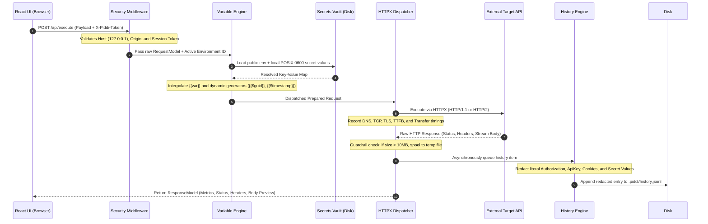

# PiddiAPI Architecture & System Design

This document provides a comprehensive technical overview of PiddiAPI's architecture, security model, execution pipeline, and storage subsystems.

---

## 1. High-Level Architecture

PiddiAPI is a **local-first, zero-cloud API client and testing engine**. It pairs a high-performance Python/FastAPI execution daemon with a responsive React/TypeScript single-page application served directly into the user's browser.

```text
+-------------------------------------------------------------------------+
|                              USER BROWSER                               |
|                                                                         |
|   +-----------------------------------------------------------------+   |
|   |                       React 18 SPA (Vite)                       |   |
|   |   - Tab Management & Composer      - Response Inspector         |   |
|   |   - Command Palette (Cmd+K)        - CodeMirror JSON Editor     |   |
|   |   - Environment Selector           - Zustand Client State       |   |
|   +-----------------------------------------------------------------+   |
+------------------------------------|------------------------------------+
                                     | HTTP/1.1 (Loopback Only)
                                     | Headers: Host: 127.0.0.1:PORT
                                     |          X-Piddi-Token: <session_token>
+------------------------------------v------------------------------------+
|                         PIDDI ENGINE (FastAPI)                          |
|                                                                         |
|   +-----------------------------------------------------------------+   |
|   |                       Security Middleware                       |   |
|   |   - Loopback Interface Binding (127.0.0.1)                      |   |
|   |   - Cryptographic Session Token Verification                    |   |
|   |   - Host Header & Origin Whitelist Validation                   |   |
|   +--------------------------------|--------------------------------+   |
|                                    |                                    |
|   +--------------------------------v--------------------------------+   |
|   |                          REST Routers                           |   |
|   |   /api/execute     /api/collections    /api/environments        |   |
|   |   /api/history     /api/workspace      /api/preferences         |   |
|   +----------------|-------------------------------|----------------+   |
|                    |                               |                    |
|   +----------------v----------------+   +----------v----------------+   |
|   |        Execution Engine         |   |   Filesystem Persistence  |   |
|   |   - Variable Interpolation      |   |   - Deterministic JSON    |   |
|   |   - Dynamic Generators          |   |   - Atomic Renames (.tmp) |   |
|   |   - HTTPX Dispatcher (H1/H2)    |   |   - POSIX 0600 Vault      |   |
|   |   - Microsecond Timing Tracer   |   |   - History Redaction     |   |
|   |   - Payload Guardrails (Disk)   |   +----------|----------------+   |
|   +----------------|----------------+              |                    |
+--------------------|-------------------------------|--------------------+
                     |                               |
                     v                               v
        +-------------------------+     +-------------------------+
        |   Target External API   |     |  Workspace File System  |
        |   (Localhost or Cloud)  |     |   (.piddi/ directory)   |
        +-------------------------+     +-------------------------+
```

---

## 2. Core Architectural Invariants

| Principle | Guarantee |
| :--- | :--- |
| **No Cloud Dependency** | Zero telemetry, zero accounts, zero remote sync. All data remains on the local disk. |
| **No SQLite / Binary DB** | All project data is stored as plain, human-readable JSON files in the workspace directory. |
| **Git-Native Versioning** | Collections and public environments can be committed, diffed, branched, and merged directly in Git. |
| **Two-Tier Secret Isolation**| Public configs (`env_<id>.json`) are committed; private secrets (`env_<id>.secrets.json`) stay local with POSIX `0600` permissions. |
| **Zero Memory Exhaustion** | Responses exceeding 10MB are automatically streamed to disk temp files; payloads >50MB are rejected by guardrails. |
| **Loopback Security Boundary**| The engine binds only to `127.0.0.1` and authenticates every request using an ephemeral, 256-bit cryptographically secure token. |

---

## 3. Data Flow & Request Execution Pipeline

When a user executes an HTTP request in the UI, the request flows through the following discrete stages:



---

## 4. Security Architecture & Threat Model

PiddiAPI's security model defends against browser-based cross-site attacks, malicious websites executing loopback requests, and accidental credential leakage:

### 4.1. Loopback-Only Binding
The engine binds strictly to `127.0.0.1` (IPv4 loopback). It never binds to `0.0.0.0` or public network interfaces.

### 4.2. Host Header Validation
FastAPI middleware intercepts every incoming request and verifies that the `Host` header strictly matches `127.0.0.1:<PORT>` or `localhost:<PORT>`. Any DNS rebinding attempts (e.g. `attacker.com` pointing to `127.0.0.1`) are immediately rejected with `403 Forbidden`.

### 4.3. Cryptographic Session Token
On startup, PiddiAPI generates an ephemeral 32-byte cryptographically random token via `secrets.token_urlsafe(32)`. 
- The token is injected into the initial frontend launch URL query parameter (`?token=...`).
- The frontend extracts the token, stores it in memory, and immediately clears the URL query parameter via `window.history.replaceState`.
- Every subsequent API call requires `X-Piddi-Token: <token>`.
- Any external page attempting `fetch("http://127.0.0.1:4111/api/...")` cannot read or guess this token due to browser Same-Origin Policy (SOP).

### 4.4. POSIX 0600 Secrets Vault
When secret variables are saved:
- They are isolated in `env_<id>.secrets.json`.
- The file is created with file permissions `0600` (`-rw-------`), ensuring only the current OS user can read or write it.
- An auto-generated `.piddi/.gitignore` prevents secret files from ever being staged or committed to version control.

### 4.5. Automatic History Sanitization
When requests are logged to `.piddi/history.jsonl`:
- Literal `Authorization`, `X-Api-Key`, and `Cookie` headers are redacted (`[REDACTED]`).
- Any resolved environment secrets are matched and replaced with their template variable keys (`{{api_key}}`).
- Literal query parameters containing `api_key`, `token`, `secret`, or `password` are sanitized.

---

## 5. Storage Subsystem & Determinism

All persistence operations in `piddi/storage/` adhere to strict consistency and crash-resilience standards:

```text
Workspace Directory:
my-project/
├── .piddi/
│   ├── .gitignore                # Auto-generated: ignores *.secrets.json, *.local.json, temp files
│   ├── collections/
│   │   ├── col_112233445566.json # Collection definition (Requests, Headers, Bodies, Auth)
│   │   └── col_998877665544.json
│   ├── environments/
│   │   ├── env_staging.json      # Public environment schema (Committed to Git)
│   │   └── env_staging.secrets.json  # Private secret vault (0600, Git Ignored)
│   └── history.jsonl             # Capped (250 items), redacted execution history
```

### 5.1. Atomic Writes
Files are never written directly to their target paths. They are written to a temporary sibling file (`.<filename>.<pid>.tmp`) and then atomically renamed via `os.replace`. This prevents file corruption in the event of an abrupt process termination or power loss.

### 5.2. Deterministic Serialization
All JSON documents are formatted with `sort_keys=True` and `indent=2`. This guarantees clean Git diffs with zero line jitter across different operating systems.

### 5.3. Schema Versioning
Every JSON entity includes `"schema_version": 1` at the root, enabling deterministic backward-compatible migrations as the platform evolves.

---

## 6. Native Desktop Distribution Architecture

For native Windows (`PiddiAPI.exe`) and macOS (`PiddiAPI.app`) distributions, PiddiAPI uses a **hybrid architecture** that combines a standalone frozen Python runtime with standard operating system console and web browser tooling:

```text
+-----------------------------------------------------------------------------+
|               Windows Explorer (PiddiAPI.exe) / macOS Finder (PiddiAPI.app) |
+--------------------------------------|--------------------------------------+
                                       | Double-click application executable
+--------------------------------------v--------------------------------------+
|  Launcher Subsystem (Windows Console / macOS AppleScript Terminal Wrapper)  |
|  1. Allocates interactive visible console / Terminal window                 |
|  2. Resolves frozen bundle paths and initializes user data dirs             |
|  3. Spawns PyInstaller ONEDIR engine runtime and binds to 127.0.0.1:4111    |
|  4. Health poller verifies /api/health with session token                   |
|  5. Automatically launches system default web browser to React workspace    |
|  6. Monitors process signals (Ctrl+C) for graceful ASGI shutdown            |
+-----------------------------------------------------------------------------+
```

This model provides:
- **Zero Heavy Webview Dependencies**: Avoids bundling massive Chromium/Electron runtimes (~250MB+).
- **Full Operational Visibility**: Developers can observe live request logs, timing traces, and errors directly in their native console / Terminal.
- **Graceful Lifecycle Control**: Standard `SIGINT` (`Ctrl+C`) cleanly drains in-flight requests, flushes history logs, and frees network ports.
