# Phase 5 Comprehensive Roadmap Reconciliation & Audit Report

**Date**: 2026-08-15  
**Version**: 2.0.0 (Updated with HistorySanitizer & Non-Blocking Persistence Contracts)  
**Evaluator**: Lead Security & Systems Architect (Adversarial Audit Mode)  
**Target Codebase**: PiddiAPI Complete Codebase (Post-Phase 4 Certification)  
**Document Generated**: `PHASE_5_ROADMAP_AUDIT.md`  

---

## 1. Executive Summary

A complete roadmap reconciliation and forensic audit of the PiddiAPI codebase was performed against:
- [TECHNICAL_SPEC.md](../../architecture/TECHNICAL_SPEC.md) (Final Implementation Contract)
- [ARCHITECTURE_REVIEW.md](../../architecture/ARCHITECTURE_REVIEW.md) (Architectural Baseline)
- [PHASE_1_AUDIT.md](../phase-1/AUDIT.md) (Engine Core & Dispatcher — Certified PASS)
- [PHASE_2_AUDIT.md](../phase-2/AUDIT.md) (Frontend Shell & Request Composer — Certified PASS)
- [PHASE_3_AUDIT.md](../phase-3/AUDIT.md) (Workspace & Collections Persistence — Certified PASS)
- [PHASE_4_AUDIT.md](../phase-4/AUDIT.md) (Environments & Secrets Vault — Certified PASS)
- Current complete backend (`piddi/`), frontend (`frontend/src/`), and test suites (`tests/`).

### Key Verdict
PiddiAPI's core foundation—Request Dispatcher, Variable Resolution Engine, Collections Persistence, and Environment/Secrets Vault—is **robust, secure, and fully certified across 92 backend tests and 52 frontend tests**.

However, because earlier roadmap phases were reorganized during development (Phase 3 focused entirely on Collections, and Phase 4 focused entirely on Environments and Secrets Isolation), several features originally grouped under Phases 4 and 5 in the initial draft specification remain **unimplemented**. 

Specifically, **Phase 5 cannot be treated merely as a "packaging and cleanup" step**. Phase 5 is the **Final Convergence Milestone** containing:
1. **Request History Subsystem** (Circular JSONL storage at `~/.piddi/history.jsonl`, `HistorySanitizer` secret redaction engine, non-blocking async execution logging, REST endpoints, and UI history inspector with restoration semantics).
2. **Client-Side cURL & Code Generation Tools** (cURL import parser on paste/URL input, export snippets for cURL, JS `fetch`, and Python `httpx`).
3. **CLI Launcher & Package Entrypoints** (`piddi` command, port scanner `4111–4120`, session token initialization, browser auto-launch, signal handling, and logging to `~/.piddi/piddi.log`).
4. **End-to-End System Packaging & Verification** (`pyproject.toml` script entrypoint, package data bundling of `piddi/static/`, and full e2e test suite).

---

## 2. Complete Specification-to-Implementation Matrix

Every single functional and non-functional requirement from [TECHNICAL_SPEC.md](../../architecture/TECHNICAL_SPEC.md) and [ARCHITECTURE_REVIEW.md](../../architecture/ARCHITECTURE_REVIEW.md) was inspected against the codebase.

| Feature / Requirement | Specification Section | Intended Phase | Current Implementation Status | Code Evidence | Remaining Work |
|---|---|---|---|---|---|
| **Canonical Request Model** | Spec §6.1 | Phase 1 | **COMPLETE** | [`piddi/models/request.py`](file:///Users/raunakmanna/Documents/Programming/Python/PiddiAPI/piddi/models/request.py) | None |
| **Canonical Response Model** | Spec §7.1 | Phase 1 | **COMPLETE** | [`piddi/models/response.py`](file:///Users/raunakmanna/Documents/Programming/Python/PiddiAPI/piddi/models/response.py) | None |
| **HTTP Methods (All 7 Verbs)** | Spec §6.2 | Phase 1 | **COMPLETE** | [`piddi/engine/dispatcher.py:199-265`](file:///Users/raunakmanna/Documents/Programming/Python/PiddiAPI/piddi/engine/dispatcher.py#L199-L265) | None |
| **Query Parameters & Headers** | Spec §6.2 | Phase 1 | **COMPLETE** | [`piddi/engine/dispatcher.py:151-193`](file:///Users/raunakmanna/Documents/Programming/Python/PiddiAPI/piddi/engine/dispatcher.py#L151-L193) | None |
| **Request Body Handlers (JSON, Form, Multipart, Raw)** | Spec §6.2 | Phase 1 | **COMPLETE** | [`piddi/engine/dispatcher.py:200-264`](file:///Users/raunakmanna/Documents/Programming/Python/PiddiAPI/piddi/engine/dispatcher.py#L200-L264) | None |
| **Variable Engine (Static {{var}})** | Spec §8.1 | Phase 1 & 4 | **COMPLETE** | [`piddi/engine/variables.py:80-145`](file:///Users/raunakmanna/Documents/Programming/Python/PiddiAPI/piddi/engine/variables.py#L80-L145) | None |
| **Dynamic Variables ($uuid, $timestamp, $isoDate, $randomInt)** | Spec §8.1 | Phase 1 | **COMPLETE** | [`piddi/engine/variables.py:27-57`](file:///Users/raunakmanna/Documents/Programming/Python/PiddiAPI/piddi/engine/variables.py#L27-L57) | None |
| **Variable Recursion Guard (Max 3)** | Spec §8.2 | Phase 1 | **COMPLETE** | [`piddi/engine/variables.py:136-140`](file:///Users/raunakmanna/Documents/Programming/Python/PiddiAPI/piddi/engine/variables.py#L136-L140) | None |
| **High-Res Monotonic Timers & Waterfall** | Spec §7.1 | Phase 1 & 2 | **COMPLETE** | [`piddi/engine/dispatcher.py:91-127`](file:///Users/raunakmanna/Documents/Programming/Python/PiddiAPI/piddi/engine/dispatcher.py#L91-L127) | None |
| **Response Payload Guardrails (<=2MB, 10MB, >50MB)** | Spec §7.2 | Phase 1 | **COMPLETE** | [`piddi/engine/dispatcher.py:309-354`](file:///Users/raunakmanna/Documents/Programming/Python/PiddiAPI/piddi/engine/dispatcher.py#L309-L354) | None |
| **Loopback Security (Session Token + Host + Origin)** | Spec §12.1 | Phase 1 | **COMPLETE** | [`piddi/security/middleware.py`](file:///Users/raunakmanna/Documents/Programming/Python/PiddiAPI/piddi/security/middleware.py) | None |
| **Frontend Application Shell** | Spec §14 | Phase 2 | **COMPLETE** | [`frontend/src/App.tsx`](file:///Users/raunakmanna/Documents/Programming/Python/PiddiAPI/frontend/src/App.tsx) | None |
| **Multi-Tab Request Manager** | Spec §4.1 | Phase 2 | **COMPLETE** | [`frontend/src/store/useRequestStore.ts`](file:///Users/raunakmanna/Documents/Programming/Python/PiddiAPI/frontend/src/store/useRequestStore.ts) | None |
| **CodeMirror 6 JSON & Raw Editor** | Spec §4.2 | Phase 2 | **COMPLETE** | [`frontend/src/components/common/CodeEditor.tsx`](file:///Users/raunakmanna/Documents/Programming/Python/PiddiAPI/frontend/src/components/common/CodeEditor.tsx) | None |
| **Interactive Request Composer** | Spec §14 | Phase 2 | **COMPLETE** | [`frontend/src/components/request/RequestBuilder.tsx`](file:///Users/raunakmanna/Documents/Programming/Python/PiddiAPI/frontend/src/components/request/RequestBuilder.tsx) | None |
| **Interactive Response Inspector** | Spec §14 | Phase 2 | **COMPLETE** | [`frontend/src/components/response/ResponseViewer.tsx`](file:///Users/raunakmanna/Documents/Programming/Python/PiddiAPI/frontend/src/components/response/ResponseViewer.tsx) | None |
| **Keyboard Shortcuts (Cmd+Enter, T, W, S, B, K)** | Spec §4.3 | Phase 2–4 | **COMPLETE** | [`frontend/src/App.tsx:28-80`](file:///Users/raunakmanna/Documents/Programming/Python/PiddiAPI/frontend/src/App.tsx#L28-L80) | None |
| **Workspace & Collections Persistence** | Spec §10.1 | Phase 3 | **COMPLETE** | [`piddi/storage/file_manager.py`](file:///Users/raunakmanna/Documents/Programming/Python/PiddiAPI/piddi/storage/file_manager.py) | None |
| **Collections REST Endpoints** | Spec §5.4 | Phase 3 | **COMPLETE** | [`piddi/routers/collections.py`](file:///Users/raunakmanna/Documents/Programming/Python/PiddiAPI/piddi/routers/collections.py) | None |
| **Sidebar Collection Tree & Request CRUD** | Spec §14 | Phase 3 | **COMPLETE** | [`frontend/src/components/layout/Sidebar.tsx`](file:///Users/raunakmanna/Documents/Programming/Python/PiddiAPI/frontend/src/components/layout/Sidebar.tsx) | None |
| **Environments Management & Storage** | Spec §5.5, §10.1 | Phase 4 | **COMPLETE** | [`piddi/storage/environment_manager.py`](file:///Users/raunakmanna/Documents/Programming/Python/PiddiAPI/piddi/storage/environment_manager.py) | None |
| **Secrets Vault Isolation (`*.secrets.json` 0600)** | Spec §9, §10.1 | Phase 4 | **COMPLETE** | [`piddi/storage/environment_manager.py:280-360`](file:///Users/raunakmanna/Documents/Programming/Python/PiddiAPI/piddi/storage/environment_manager.py#L280-L360) | None |
| **Auto-Generated `.piddi/.gitignore`** | Spec §10.2 | Phase 3 & 4 | **COMPLETE** | [`piddi/storage/environment_manager.py:53-70`](file:///Users/raunakmanna/Documents/Programming/Python/PiddiAPI/piddi/storage/environment_manager.py#L53-L70) | None |
| **User Preferences (`preferences.json`)** | Spec §5, §10.1 | Phase 4 | **COMPLETE** | [`piddi/storage/preferences_manager.py`](file:///Users/raunakmanna/Documents/Programming/Python/PiddiAPI/piddi/storage/preferences_manager.py) | None |
| **Request History Model & Schema** | Spec §11.1 | Spec Phase 4 / Phase 5 | **MISSING** | No `piddi/models/history.py` file exists | Implement Pydantic & TS `HistoryRecord` schemas |
| **History Persistence (`~/.piddi/history.jsonl`)** | Spec §11.1 | Spec Phase 4 / Phase 5 | **MISSING** | No `piddi/storage/history.py` file exists | Implement async JSONL append writer |
| **History Pruning & Circular Retention (200/250)** | Spec §11.2 | Spec Phase 4 / Phase 5 | **MISSING** | No pruning logic exists in codebase | Implement circular capping & corrupted line recovery |
| **History REST Endpoints (`GET`, `DELETE /api/history`)** | Spec §5.6 | Spec Phase 4 / Phase 5 | **MISSING** | No `piddi/routers/history.py` file exists | Implement history router with token auth |
| **Execution History Auto-Logging** | Spec §3.3 | Spec Phase 4 / Phase 5 | **MISSING** | `execute.py` does not call history logger | Non-blocking async logging hook with `HistorySanitizer` |
| **History Security & Secret Redaction** | Spec §9, §11.1 | Spec Phase 4 / Phase 5 | **MISSING** | No secret masking in history writer | Implement `HistorySanitizer` with case-insensitive checks |
| **Frontend History State Store** | Spec §4.1 | Spec Phase 4 / Phase 5 | **MISSING** | No `frontend/src/store/useHistoryStore.ts` exists | Implement Zustand history store |
| **Frontend Sidebar History View & 1-Click Restore** | Spec §14 | Spec Phase 4 / Phase 5 | **MISSING** | Placeholder text in [`Sidebar.tsx:540-548`](file:///Users/raunakmanna/Documents/Programming/Python/PiddiAPI/frontend/src/components/layout/Sidebar.tsx#L540-L548) | Implement history list, search/filter, and restoration |
| **cURL Import Parser** | Spec §4.1, §17 (AC-2) | Spec Phase 4 / Phase 5 | **MISSING** | No `frontend/src/utils/curlParser.ts` exists | Implement pure TS cURL parser & auto-paste detection |
| **cURL & Code Snippet Generator** | Spec §4.1, §16.2 | Spec Phase 4 / Phase 5 | **MISSING** | No `frontend/src/utils/snippetGenerator.ts` exists | Implement cURL, Fetch, and Python httpx generator |
| **Copy as cURL / Export UI Actions** | Spec §9, §14 | Spec Phase 4 / Phase 5 | **MISSING** | No export buttons in UI | Add "Copy as cURL" and Code Snippet dialog/actions |
| **CLI Entrypoint (`piddi` command)** | Spec §13, §19 | Phase 5 | **MISSING** | No `piddi/cli.py` exists; `pyproject.toml` missing script | Implement CLI runner with argparse |
| **CLI Port Scanner (4111–4120)** | Spec §13.2 | Phase 5 | **MISSING** | No CLI startup port scanning routine | Implement socket port test loop |
| **CLI Browser Auto-Launch** | Spec §13.2 | Phase 5 | **MISSING** | No browser launch hook exists | Implement `webbrowser.open` on startup |
| **CLI Diagnostic Logging (`~/.piddi/piddi.log`)** | Spec §3.4, §13 | Phase 5 | **MISSING** | No file logger configured for CLI | Configure rotating file logger |
| **Packaging & Static Asset Distribution** | Spec §1.1, §12.2 | Phase 5 | **PARTIAL** | Static bundle built, but `pyproject.toml` lacks packaging config | Configure `package-data` and console scripts in `pyproject.toml` |
| **Full End-to-End Test Suite** | Spec §16, §19 | Phase 5 | **MISSING** | `tests/test_e2e.py` not implemented | Implement comprehensive CLI & loopback e2e test suite |
| **Arbitrary Scripting Runtime** | Spec §18.4 | Excluded | **PROHIBITED** | N/A (Confirmed absent) | None (Strictly excluded from MVP) |
| **Cloud Sync & Telemetry** | Spec §18.6 | Excluded | **PROHIBITED** | N/A (Confirmed absent) | None (Strictly excluded from MVP) |

---

## 3. Current Architecture State

### Backend State (`piddi/`)
- **FastAPI Engine (`piddi/main.py`)**: Fully wired with `LoopbackSecurityMiddleware`, CORS, static HTML token injection, exception handling, and registered routers for `workspace`, `collections`, `environments`, `preferences`, and `execute`.
- **Dispatcher Core (`piddi/engine/dispatcher.py`)**: Complete HTTPX connection manager supporting HTTP/1.1 & HTTP/2, all 7 verbs, multi-value headers, multipart file streaming, redirect policies, high-res trace metrics, and payload streaming guardrails.
- **Variable Engine (`piddi/engine/variables.py`)**: Full static interpolation, dynamic generators (`$uuid`, `$timestamp`, `$isoDate`, `$randomInt`), and 3-level recursion bounds.
- **Storage Subsystems (`piddi/storage/`)**:
  - `file_manager.py`: Atomically reads/writes `.piddi/collections/col_<id>.json` with opaque stable IDs and known credential sanitization.
  - `environment_manager.py`: Atomically reads/writes public `.piddi/environments/env_<id>.json` and protected `env_<id>.secrets.json` (`0o600` permissions, `asyncio.Lock` serialization).
  - `preferences_manager.py`: Manages `~/.piddi/preferences.json`.
- **What is Missing in Backend**:
  - `piddi/models/history.py`
  - `piddi/storage/history.py` (including `HistorySanitizer` and `HistoryManager`)
  - `piddi/routers/history.py`
  - `piddi/cli.py`
  - `history` router registration in `piddi/main.py`
  - Asynchronous, non-blocking logging trigger in `piddi/routers/execute.py`
  - `[project.scripts]` in `pyproject.toml`

### Frontend State (`frontend/src/`)
- **State Stores (`frontend/src/store/`)**:
  - `useRequestStore.ts`: Manages multi-tab draft requests, active scratchpad, dirty tracking, execution status, and response storage.
  - `useWorkspaceStore.ts`: Manages collection list, CRUD, nested request CRUD, reordering, and disk sync.
  - `useEnvironmentStore.ts`: Manages environment list, variable updates, secret reveal in-memory cache, and modal state.
- **UI Components (`frontend/src/components/`)**:
  - `RequestBuilder.tsx`: Verb selector, URL input, composer sub-tabs (Params, Headers, Auth, Body, Settings), and Send button.
  - `ResponseViewer.tsx`: Status code badge, latency counter, size counter, sub-tabs (Formatted JSON Body, Headers, Cookies, Network Waterfall).
  - `Sidebar.tsx`: Collections tree view, active tab list, and placeholder History view.
  - `EnvironmentModal.tsx`: Variable grid, secret toggle, reveal/hide, and disk synchronization.
  - `ShortcutsModal.tsx`: Keyboard shortcuts cheat-sheet.
- **What is Missing in Frontend**:
  - `frontend/src/store/useHistoryStore.ts`
  - `frontend/src/utils/curlParser.ts`
  - `frontend/src/utils/snippetGenerator.ts`
  - Real History UI in `Sidebar.tsx` (replacing the placeholder) with search, clear, and restoration semantics
  - cURL paste handler in `RequestBuilder.tsx` / URL input
  - "Copy as cURL" / "Generate Code" UI actions in `RequestBuilder.tsx` and `ResponseViewer.tsx`

---

## 4. Missing Features Breakdown

The remaining features required to complete PiddiAPI v1.0.0 fall into three cohesive architectural areas:

```
Remaining Work for 100% Spec Compliance:
┌────────────────────────────────────────────────────────────────────────┐
│ 1. REQUEST HISTORY SUBSYSTEM                                           │
│    ├── piddi/models/history.py (HistoryRecord schema)                 │
│    ├── piddi/storage/history.py (HistorySanitizer & JSONL buffer)      │
│    ├── piddi/routers/history.py (GET, DELETE /api/history)             │
│    ├── Non-blocking async logging hook in execute.py                  │
│    ├── frontend/src/store/useHistoryStore.ts (History state)           │
│    └── frontend/src/components/layout/Sidebar.tsx (History list & UI)  │
├────────────────────────────────────────────────────────────────────────┤
│ 2. CLIENT-SIDE cURL & CODE SNIPPET TOOLS                               │
│    ├── frontend/src/utils/curlParser.ts (cURL -> Request model)        │
│    ├── frontend/src/utils/snippetGenerator.ts (cURL, fetch, httpx)    │
│    ├── URL bar paste detection for cURL strings                        │
│    └── "Copy as cURL" / "Code Snippets" buttons in Request/Response    │
├────────────────────────────────────────────────────────────────────────┤
│ 3. CLI LAUNCHER, PACKAGING & END-TO-END VERIFICATION                   │
│    ├── piddi/cli.py (argparse, port scanner 4111-4120, browser launch) │
│    ├── Rotating diagnostic logger to ~/.piddi/piddi.log                │
│    ├── pyproject.toml package entrypoints & static asset inclusion     │
│    ├── tests/test_history.py (Sanitizer, circular buffer, async tests) │
│    ├── tests/test_cli.py (Port selection & argument tests)             │
│    └── tests/test_e2e.py (Full browser/CLI/execution lifecycle test)   │
└────────────────────────────────────────────────────────────────────────┘
```

---

## 5. Phase 5 Candidate Scope

Phase 5 represents the final delivery phase that completes the entire PiddiAPI specification:

### Primary Deliverables of Phase 5:
1. **History Engine & Persistence**:
   - Backend `HistorySanitizer` for deterministic case-insensitive secret redaction.
   - Backend `HistoryManager` with atomic append, corrupted line tolerance, and circular pruning (200 lines).
   - Non-blocking, best-effort asynchronous logging hook in `execute.py` that never fails HTTP requests.
   - History REST endpoints (`GET /api/history?limit=200`, `DELETE /api/history`).
   - Frontend `useHistoryStore` and Sidebar History panel with search, clear, and 1-click restore to scratchpad.
2. **Client-Side Interoperability Tools**:
   - `curlParser.ts` for instant paste-to-request conversion.
   - `snippetGenerator.ts` for 1-click export to cURL, JavaScript `fetch`, and Python `httpx`.
   - UI buttons in `RequestBuilder` and `ResponseViewer`.
3. **CLI Launcher & Package Entrypoints**:
   - `piddi/cli.py` implementing the complete command-line interface.
   - Automatic port fallback (4111 -> 4112 ... -> 4120).
   - Session token creation and deterministic injection into served static HTML.
   - Headless `--no-browser` toggle and `--dev` mode support.
   - `pyproject.toml` console script entry point configuration.
4. **End-to-End System Verification**:
   - Full Vitest suite for `curlParser` and `snippetGenerator`.
   - Full Pytest suite for `test_history.py`, `test_cli.py`, and `test_e2e.py`.
   - Certified production build and packaging validation.

---

## 6. History Requirements Extracted from the Specification

The specification requirements for Request History have been extracted from [TECHNICAL_SPEC.md](../../architecture/TECHNICAL_SPEC.md) (§3.1, §3.3, §5.6, §9, §11.1, §11.2, §14, §16.1, §17) and [ARCHITECTURE_REVIEW.md](../../architecture/ARCHITECTURE_REVIEW.md) (§2.1, §3, §4, §5, §11):

| Aspect | Specification Requirement | Rationale / Architectural Contract |
|---|---|---|
| **Storage Location** | `~/.piddi/history.jsonl` | Global user home directory, strictly outside workspace `.piddi/`. Never committed to Git. |
| **File Format** | JSON Lines (`.jsonl`) | Plain text, append-only, UTF-8 encoded, newline-delimited. Zero SQLite, zero binary blobs. |
| **Record Schema** | `id`, `timestamp`, `method`, `url`, `status`, `duration_ms`, `size_bytes`, `request_snapshot` | Compact metadata plus a self-contained sanitized request snapshot for restoration. |
| **Maximum Entries** | Capped at **200 most recent records** | Bounds memory and file size to < 200KB; ensures sub-15ms scan times. |
| **Retention Policy** | Circular buffer (Prune to 200 when records > 250) | Batched pruning avoids rewriting the file on every single request dispatch. |
| **Cleanup Behavior** | `DELETE /api/history` clears the file | Empties the history file and resets active UI list. |
| **Corrupted Line Tolerance** | Silent skip on unparseable JSON lines | If a line is corrupted (e.g. abrupt power loss), loader skips line without crashing. |
| **Stored Request Info** | `method`, `url`, `params`, `headers` (sanitized), `auth` (sanitized), `body` (`type`, `raw`, `form_params`) | Structured data needed to reconstruct and restore the request. |
| **Stored Response Info** | `status`, `duration_ms`, `size_bytes` | High-level execution metrics only. |
| **Response Body Storage** | **DO NOT STORE** in history JSONL | Omitted by design. Prevents multi-megabyte disk bloat and eliminates response token leakage. |
| **Auth Values & Secrets** | **MUST BE REDACTED** by `HistorySanitizer` | Literal Bearer tokens, Basic passwords, and API keys must never be written to `history.jsonl`. |
| **Git Tracking** | **STRICTLY PROHIBITED** | `~/.piddi/history.jsonl` is in user home directory; workspace `.gitignore` ignores any local history cache. |
| **Loading Mechanism** | `GET /api/history?limit=200` via `aiofiles` | Asynchronously reads file in reverse chronological order (newest first). |
| **Display in UI** | Sidebar "History" tab | Status badge, method badge, URL path, latency, size, timestamp. |
| **Search & Filtering** | In-memory text filter in UI | Filter history list by URL substring, HTTP method, or status code. |
| **Restoration Semantics** | Click history item -> Active tab | Restores request structure; template variables remain executable; redacted literal secrets require re-entry. |
| **Execution Performance** | Asynchronous / Best-Effort | History persistence runs asynchronously and never blocks or fails HTTP request execution. |

---

## 7. Security Considerations & HistorySanitizer Contract

Request history must be protected against credential leakage. Phase 5 establishes a dedicated, deterministic `HistorySanitizer` adhering to the core project philosophy established in Phases 3 and 4:

> **Phase 3/4 Security Invariant**: Known sensitive locations are strictly sanitized; arbitrary request bodies are treated as opaque and preserved verbatim.

```
                          REQUEST DISPATCH & SANITIZATION PIPELINE
                          
   [Draft Request with {{authToken}} / literal secrets]
                 │
                 ├──► [1. Snapshot for History BEFORE Interpolation]
                 │          │
                 │          ▼
                 │    [HistorySanitizer]
                 │    ├── Sensitive Headers (case-insensitive) ──► Redact literals to [REDACTED]
                 │    │                                            (Preserve {{templates}})
                 │    ├── Sensitive Query Params (case-insensitive) ──► Redact literals to [REDACTED]
                 │    │                                                 (Preserve {{templates}})
                 │    ├── AuthConfig (Bearer, Basic, API Key) ──► Redact literals to [REDACTED]
                 │    │                                           (Preserve {{templates}})
                 │    └── Request Body (JSON, Form, Raw) ───────► Opaque / Verbatim
                 │          │
                 │          ▼
                 │    [Async Non-Blocking Append to ~/.piddi/history.jsonl]
                 │    (If fails: log diagnostic warning, do NOT fail HTTP response)
                 │
                 ▼
      [2. Variable Interpolation]
                 │ (Environment secrets injected into wire payload: "Bearer secret_xyz")
                 ▼
         [3. HTTPX Socket Dispatch]
                 │
                 ▼
        [4. API Response Stream]
        (Status, latency, and size recorded in history; Response Body NEVER written to history.jsonl)
```

### 7.1 Exact Sensitive Header Specification
The `HistorySanitizer` performs **case-insensitive matching** on all request header keys against the following known-sensitive header registry:
1. `Authorization`
2. `Proxy-Authorization`
3. `X-API-Key`
4. `X-Auth-Token`
5. `X-Access-Token`
6. `X-API-Token`
7. `Cookie`
8. `Set-Cookie`

**Redaction Rule for Sensitive Headers**:
- If the header value contains a variable template reference (e.g. `Bearer {{authToken}}` or `{{apiKey}}`), it is **preserved verbatim**.
- If the header value contains a literal secret (e.g. `Bearer eyJhbGciOi...` or `my_raw_cookie=123`), the value is replaced with `"[REDACTED]"`.

### 7.2 Exact Sensitive Query Parameter Specification
The `HistorySanitizer` performs **case-insensitive matching** on all query parameters (both in `request.params` and parsed from `request.url`) against the following sensitive parameter name registry:
1. `api_key`
2. `apikey`
3. `api-key`
4. `access_token`
5. `auth_token`
6. `authorization`
7. `token`
8. `secret`
9. `password`
10. `client_secret`

**Redaction Rule for Sensitive Query Parameters**:
- If the parameter value is a template expression (e.g. `{{apiKey}}` or `{{accessToken}}`), it is **preserved verbatim**.
- If the parameter value is a literal value (e.g. `secret123`), the value is replaced with `"[REDACTED]"`.

### 7.3 AuthConfig Redaction
For `request.auth`:
- `Bearer`: If `token` is literal, sanitize to `"[REDACTED]"`; if `{{token}}`, preserve.
- `Basic`: If `password` is literal, sanitize to `"[REDACTED]"`; if `{{password}}`, preserve. `username` is preserved.
- `API Key`: If `value` is literal, sanitize to `"[REDACTED]"`; if `{{key}}`, preserve.

### 7.4 Arbitrary Request Body Handling (Opaque / Verbatim)
- **Do NOT heuristically scan arbitrary JSON, XML, or raw request bodies for secrets**.
- Request bodies (`body.raw` and `body.form_params`) are preserved **verbatim** without modification.
- This preserves the architectural principle that the user owns their payload data structure while known protocol-level credentials are deterministically protected.

### 7.5 Resolved Environment Secrets Isolation
- The request snapshot is taken **strictly prior to variable interpolation**.
- Environment secrets resolved from `.secrets.json` during the execution stage exist only in ephemeral socket memory and **never enter `request_snapshot` or `~/.piddi/history.jsonl`**.

---

## 8. Async History Persistence & Failure Semantics

History recording is a non-critical observability concern that **must never compromise request execution reliability**.

### 8.1 Non-Blocking Execution Protocol
1. User dispatches `POST /api/execute`.
2. Request snapshot is taken and sanitized via `HistorySanitizer`.
3. Dispatcher executes the network request via HTTPX and produces a `CanonicalResponseModel`.
4. History persistence is triggered **asynchronously and out-of-band** (e.g. via `asyncio.create_task` or FastAPI `BackgroundTasks`).
5. `POST /api/execute` returns the `CanonicalResponseModel` to the client immediately.

### 8.2 Failure Isolation Guarantee
If appending to `~/.piddi/history.jsonl` fails for any reason (disk full, permission denied, filesystem error, JSON serialization bug):
- **The HTTP execution response MUST remain completely successful.**
- The history error is logged to `~/.piddi/piddi.log` as a diagnostic warning (`logger.warning(...)`).
- Under NO circumstances is an HTTP 500 or execution error returned to the user solely because history persistence failed.

### 8.3 Performance Target
- **Target**: History append operations should normally complete within a few milliseconds in the background.
- **Contract**: Performance is decoupled from HTTP dispatch latency; HTTP execution returns as soon as socket transfer completes.

---

## 9. History Restoration Semantics

Restoring a request from history must have explicit, unambiguous behavior:

### 9.1 Template-Based Credentials (Executable)
- *Example*: Request configured with `Authorization: Bearer {{authToken}}` or `?apiKey={{apiKey}}`.
- *History Snapshot*: Preserves `{{authToken}}` and `{{apiKey}}` verbatim.
- *Restoration Behavior*: Populating the active tab or opening a new tab restores the exact template syntax. The restored request is **immediately executable** against the active environment without manual editing.

### 9.2 Literal Credentials (Redacted / Structurally Restored)
- *Example*: Request configured with literal `Authorization: Bearer real_secret_value`.
- *History Snapshot*: Stores `Authorization: [REDACTED]` or `token: "[REDACTED]"`.
- *Restoration Behavior*: Populating the active tab restores the complete request structure (method, URL, headers, parameters, body), but sensitive fields display `"[REDACTED]"`.
- *Executable State*: The user must re-enter their credential or replace it with an environment variable `{{var}}` before executing.
- *Zero Secret Recovery*: PiddiAPI makes zero attempts to recover redacted literal secrets (as they were never persisted to disk).
- *UI State*: The UI displays `[REDACTED]` clearly in the header/auth input fields, making the need for credential entry visually obvious.

---

## 10. Dependencies Between Remaining Features

The remaining features exhibit clean, acyclic dependencies:

```mermaid
flowchart TD
    subgraph HistoryEngine [History Subsystem]
        H1[History Pydantic Model] --> H2[HistorySanitizer Engine]
        H2 --> H3[History File Manager JSONL]
        H3 --> H4[History REST Router /api/history]
        H4 --> H5[Async Execute Logging Hook]
        H5 --> H6[Frontend useHistoryStore & Sidebar UI]
    end

    subgraph ClientTools [Client-Side Tools]
        C1[cURL Parser Utility] --> C2[URL Bar Paste Detection]
        C3[Snippet Generator Utility] --> C4[Copy as cURL / Code Actions]
    end

    subgraph Packaging [CLI & Packaging]
        P1[CLI Entrypoint piddi/cli.py] --> P2[Port Scanner & Session Token]
        P2 --> P3[Static Asset Serving]
        P3 --> P4[pyproject.toml Scripts & Package Data]
    end

    subgraph E2E [Verification]
        H6 & C2 & C4 & P4 --> E1[test_e2e.py & Full Test Suite]
    end
```



- **History Backend** (`models/history.py`, `storage/history.py`, `routers/history.py`) has zero dependency on frontend and can be implemented and tested first with Pytest.
- **cURL Parser & Snippet Generator** are pure TypeScript utilities with zero backend dependencies and can be tested with Vitest.
- **CLI Launcher** wraps the existing FastAPI server and can be verified against both dev and static modes.
- **End-to-End Suite** tests the integrated system.

---

## 11. Recommended Implementation Order

To maintain strict vertical slice hygiene and prevent regressions, Phase 5 will be executed in the following order:

```
Step 1: History Subsystem (Backend)
  1.1 Create piddi/models/history.py (HistoryRecord & snapshot schemas)
  1.2 Create piddi/storage/history.py (HistorySanitizer, HistoryManager, circular pruning)
  1.3 Create piddi/routers/history.py (GET, DELETE /api/history)
  1.4 Connect async non-blocking logging hook in piddi/routers/execute.py
  1.5 Add tests/test_history.py (Sanitizer rules, circular capping, async error tolerance)

Step 2: History Subsystem (Frontend)
  2.1 Add HistoryRecord types to frontend/src/types/index.ts
  2.2 Add History API methods to frontend/src/api/client.ts
  2.3 Create frontend/src/store/useHistoryStore.ts (Fetch, clear, restore)
  2.4 Implement Sidebar History tab in frontend/src/components/layout/Sidebar.tsx
  2.5 Add frontend Vitest tests for useHistoryStore & SidebarHistory

Step 3: Client-Side Interoperability Tools
  3.1 Create frontend/src/utils/curlParser.ts (Parse cURL commands)
  3.2 Create frontend/src/utils/snippetGenerator.ts (Generate cURL, Fetch, Python httpx)
  3.3 Add Vitest unit tests in frontend/src/utils/__tests__/
  3.4 Integrate cURL paste detection in RequestBuilder.tsx URL bar
  3.5 Add "Copy as cURL" / Snippets modal in RequestBuilder and ResponseViewer

Step 4: CLI Launcher, Packaging & Logging
  4.1 Create piddi/cli.py (Argparse, port scanner 4111-4120, browser launcher, signal handler)
  4.2 Configure rotating file logging to ~/.piddi/piddi.log
  4.3 Update pyproject.toml with [project.scripts] and [tool.setuptools.package-data]
  4.4 Build production frontend bundle into piddi/static/

Step 5: End-to-End Integration Suite & Final Audit
  5.1 Create tests/test_cli.py (CLI argument and port selection tests)
  5.2 Create tests/test_e2e.py (Full application loopback lifecycle)
  5.3 Execute 100% backend Pytest and frontend Vitest suites
  5.4 Run linter (ruff) and TypeScript compiler (tsc)
  5.5 Produce PHASE_5_FINAL_AUDIT.md
```

---

## 12. Acceptance Criteria Candidates for Phase 5

The following acceptance criteria will govern the Phase 5 implementation and verification:

### AC-5-1 (History Asynchronous Auto-Logging & Non-Blocking Resilience)
- *Given* an active PiddiAPI session,
- *When* the user executes an HTTP request (`POST /api/execute`),
- *Then* the backend must return the HTTP response immediately and schedule an asynchronous append of a sanitized `HistoryRecord` to `~/.piddi/history.jsonl`.
- *Given* the history file is write-protected or the writer fails,
- *When* the user executes a request,
- *Then* `POST /api/execute` must still return the HTTP response successfully with status 200 (or actual response status) and log a diagnostic warning without returning HTTP 500.

### AC-5-2 (HistorySanitizer Header & Query Redaction)
- *Given* a request containing sensitive headers (`Authorization`, `Proxy-Authorization`, `X-API-Key`, `X-Auth-Token`, `X-Access-Token`, `X-API-Token`, `Cookie`, `Set-Cookie`) and sensitive query parameters (`api_key`, `apikey`, `api-key`, `access_token`, `auth_token`, `authorization`, `token`, `secret`, `password`, `client_secret`),
- *When* the request is sanitized for history recording:
  1. Literal values in sensitive headers and query parameters must be replaced with `"[REDACTED]"`.
  2. Template expressions (e.g. `{{authToken}}`, `{{apiKey}}`) must be preserved verbatim.
  3. Header and parameter name checks must match case-insensitively (`x-api-key`, `API_KEY`, `Authorization`).
  4. Arbitrary request body JSON containing password fields must be preserved verbatim without heuristic alteration.
  5. Resolved environment secrets must never appear in the history record.

### AC-5-3 (History Circular Buffer & Corrupted Line Recovery)
- *Given* a history file containing 250 entries,
- *When* a new request is dispatched,
- *Then* the history manager must automatically prune the file to the newest 200 records.
- *Given* a history file containing malformed JSON lines,
- *When* `GET /api/history` is queried,
- *Then* the history loader must silently skip the corrupted lines and return all valid records without throwing an exception.

### AC-5-4 (History Restoration Semantics)
- *Given* a history record containing template variables (`{{apiKey}}`),
- *When* the user restores the record,
- *Then* the request must be populated with the intact template variable and be immediately executable.
- *Given* a history record containing redacted literal credentials (`[REDACTED]`),
- *When* the user restores the record,
- *Then* the request must restore the structure with `[REDACTED]` visibly displayed in the credential field, requiring user input before execution.

### AC-5-5 (cURL Paste Auto-Import)
- *Given* the user copies a standard cURL command:
  `curl -X POST https://api.dev/v1/auth -H "Content-Type: application/json" -d '{"email":"dev@test.com"}'`,
- *When* the user pastes the string into the URL input bar,
- *Then* PiddiAPI must automatically populate Method to `POST`, URL to `https://api.dev/v1/auth`, Headers to `Content-Type: application/json`, and Body to `{"email":"dev@test.com"}`.

### AC-5-6 (Code Snippet Export)
- *Given* an active request configured in the composer,
- *When* the user clicks "Copy as cURL" or opens Code Snippets,
- *Then* PiddiAPI must generate valid, runnable cURL, JavaScript `fetch`, and Python `httpx` code matching the current request.

### AC-5-7 (CLI Port Auto-Assignment & Headless Toggle)
- *Given* port `4111` is already occupied by another process,
- *When* the user executes `piddi`,
- *Then* the CLI must automatically scan and bind to the next open port (e.g. `4112`), generate a session token, and launch the browser at `http://127.0.0.1:4112/`.
- *Given* `--no-browser` is passed, the CLI must start the server without launching the system browser.

### AC-5-8 (Package Installation & Clean Startup)
- *Given* a fresh Python environment,
- *When* `pip install -e .` is run followed by `piddi --help`,
- *Then* the command must output the CLI help description with zero import or runtime errors.

---

## 13. Security Test Matrix for History

The following test suite in `tests/test_history.py` will verify the `HistorySanitizer` and persistence invariants:

| Test Case | Description & Assertion |
|---|---|
| `test_history_literal_authorization_redacted` | Verifies `Authorization: Bearer secret123` is sanitized to `[REDACTED]`. |
| `test_history_templated_authorization_preserved` | Verifies `Authorization: Bearer {{token}}` is preserved verbatim as `Bearer {{token}}`. |
| `test_history_literal_x_api_key_redacted` | Verifies `X-API-Key: key_123` is sanitized to `[REDACTED]`. |
| `test_history_literal_cookie_redacted` | Verifies `Cookie: session_id=abc` is sanitized to `[REDACTED]`. |
| `test_history_literal_api_key_query_param_redacted` | Verifies URL `http://api.dev?api_key=secret` and params `[("api_key", "secret")]` are sanitized to `[REDACTED]`. |
| `test_history_templated_api_key_query_param_preserved` | Verifies URL `http://api.dev?api_key={{apiKey}}` is preserved verbatim. |
| `test_history_mixed_case_sensitive_names` | Verifies `x-ApI-kEy`, `AUTH_TOKEN`, `Api_Key`, `SeT-cOoKiE` are all detected and sanitized. |
| `test_history_arbitrary_json_body_preserved_verbatim` | Verifies `{"password": "secret", "user": "test"}` in body is stored verbatim without heuristic corruption. |
| `test_history_resolved_environment_secret_never_persisted` | Verifies that executing a request with active environment secrets records only the template snapshot, not resolved secrets. |
| `test_history_writer_failure_does_not_fail_execute` | Mocks file write failure and verifies `POST /api/execute` still returns status 200 and valid response body. |
| `test_history_capping_200_and_pruning_at_250` | Writes 260 history lines and verifies file is pruned to the newest 200 records. |
| `test_history_corrupted_json_lines_skipped` | Injects malformed text lines into `history.jsonl` and verifies loader returns all valid lines cleanly. |
| `test_history_clear_endpoint` | Verifies `DELETE /api/history` truncates file and returns `{"cleared": true}`. |
| `test_history_restoration_template_executable` | Verifies restoring a templated history record produces an executable request model. |
| `test_history_restoration_literal_redacted` | Verifies restoring a redacted literal history record populates `[REDACTED]` in credential fields. |

---

## 14. Decisions for User Alignment

The following design decisions are documented for explicit alignment:

1. **HistorySanitizer Scope**:
   - Sanitization is strictly confined to the explicit list of known sensitive headers, known sensitive query parameters, and `AuthConfig` fields.
   - Arbitrary request body strings (JSON/XML/Raw) are preserved opaque and verbatim.
2. **Asynchronous History Persistence**:
   - HTTP response generation is never blocked or failed by history disk I/O.
   - History persistence failures are recorded in diagnostic logs without surfacing as HTTP 500 errors.
3. **Restoration Transparency**:
   - Redacted secrets remain `[REDACTED]` upon restoration, making credential requirements visually clear to the developer.
4. **Static Bundle Packaging**:
   - `pyproject.toml` is configured with `[tool.setuptools.package-data]` so that `piddi/static/` is bundled when building a Python wheel/package.

---

## 15. Verification & Audit Summary

- **Total Requirements Audited**: 43 specific requirements across 19 specification sections.
- **Features Already Certified & Complete**: 24 core engine, frontend composer, persistence, and environment features.
- **Features Scheduled for Phase 5**: History subsystem (with `HistorySanitizer`), cURL import/export tools, CLI launcher, packaging, and end-to-end test suite.
- **Prohibited Features Verified Absent**: Zero SQLite, zero PyWebView in MVP, zero arbitrary code execution, zero telemetry.
- **Current Test Status**: 92 backend tests passing, 52 frontend tests passing.
- **Next Step**: Await user review and approval of this updated Roadmap Audit before drafting the Phase 5 Implementation Plan.
